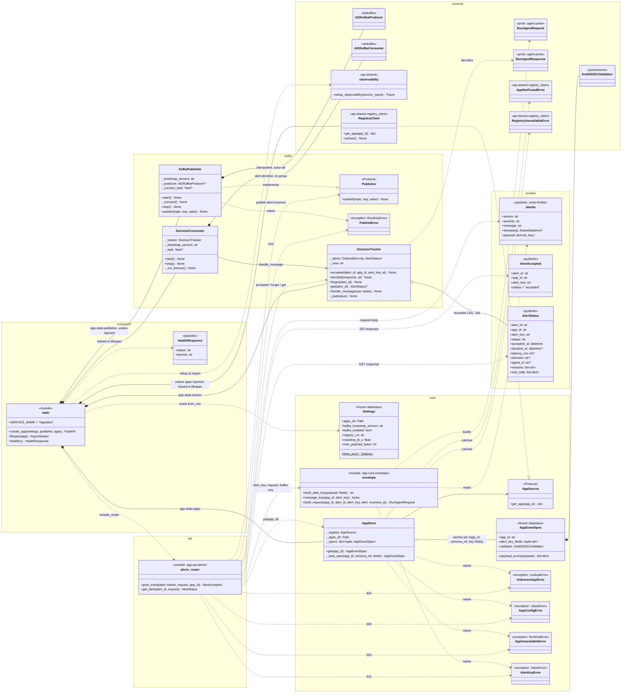

# ingestion — class diagram

As built through Day 8 of `docs/plan.md` (unchanged since Day 6). `ingestion` is the platform's
REST front door: it accepts an alert at `POST /apps/{app_id}/events`,
validates it against that app's rules (read from `registry`), turns it into
a `RunAgentRequest`, and publishes it to `alert.received`. It never runs an agent and never decides anything.

Python modules that are plain functions (no class) are drawn as
`<<module>>` boxes, so every piece of behaviour shows up somewhere.
Third-party and cross-service types are in the `external` group.

## Classes and modules

### Entry point — `app/main.py`

**`main` (module)** is the composition root. `create_app()` builds every
collaborator and stores them on `app.state` so the router can reach them
without globals:

| `app.state` key | Object | Notes |
|---|---|---|
| `settings` | `Settings` | |
| `apps` | `AppStore` | over the `RegistryClient` (or a fake a test passes as `apps`) |
| `publisher` | `Publisher` | a `KafkaPublisher`, or the fake a test passes in |
| `tracker` | `DecisionTracker` | Day 4 debug only |

`lifespan()` starts `KafkaPublisher` and `DecisionConsumer` as background
tasks on startup and stops them on shutdown, then closes the
`RegistryClient` if `create_app()` made one. When a test injects a
`publisher`, or `KAFKA_ENABLED=false`, neither Kafka object is created, so
the app runs with no broker. `setup_observability()` is called at import
time so logging is JSON from the first line.

**`HealthResponse`** is the `/healthz` body (`status`, `service`). Compose
health checks use it.

### API — `app/api/alerts.py`

**`alerts_router` (module)** has the two HTTP endpoints.

- **`post_event`**, `POST /apps/{app_id}/events`: the intake. The URL
  chooses the app; nothing infers it. Everything is validated before Kafka
  is touched, in this order:
  1. The envelope, by pydantic through `AlertIn`. Failure is a `422`.
  2. The serialized payload size against `max_payload_bytes`. Failure is a `413`.
  3. The app's spec, from `AppStore`. An unregistered app is a `404`;
     `registry` unreachable with nothing cached is a `503` with
     `Retry-After: 5`; a broken app (`AppConfigError`) is a `500`.
  4. The payload against the app's JSON Schema. Failure is a `422` listing
     every error.
  5. `alert_key`, built by `build_alert_key`. A missing field is a `422`.

  It then mints `alert_id`, builds the protobuf, records it in the tracker
  and publishes. A `PublishError` becomes a `503` with `Retry-After: 5`,
  and the tracker entry is removed. The tracker is updated *before*
  publishing because `alert.decided` can arrive before `publish()` returns.
- **`get_alert`**, `GET /alerts/{alert_id}`: a debug view that reads
  `DecisionTracker`. It returns `404` for an alert this replica never saw.
  It will be removed on Day 9.

Day 4's `POST /alerts` is gone (it now returns `404`).

### Core — `app/core/`

**`Settings`** (`config.py`): frozen dataclass of everything configurable.
`from_env()` reads `APPS_DIR`, `KAFKA_BOOTSTRAP_SERVERS`, `KAFKA_ENABLED`,
`REGISTRY_URL` (default `http://localhost:8005`), `MANIFEST_TTL_S`
(default 30, the same as `orchestrator` and `tool-gateway`) and
`MAX_PAYLOAD_BYTES`. `apps_dir` defaults to
`backend/apps`, a path that is the same in the repo and in the Docker image.

**`AppStore`** (`apps.py`): resolves `app_id` to an `AppEventSpec`.
- It asks its **`AppSource`** (the `ap-shared` `RegistryClient` in
  production, a fake in tests) for the app: `GET /apps/{app_id}` behind the
  shared 30s TTL cache. The client rejects a non-slug `app_id` before it
  becomes a URL, and caches 404s too, so a newly registered app is
  accepted within one TTL.
- From the manifest it reads `event_schema_ref` and `alert_key_fields`; the
  schema itself is a file in this image (`APPS_DIR/{app_id}/`).
- It keeps one compiled spec per `(app_id, event_schema_ref,
  alert_key_fields)`, so a manifest change builds a new spec on the next
  fetch, with no restart.
- `AppNotFoundError` becomes `UnknownAppError` (`404`);
  `RegistryUnavailableError` becomes `AppUnavailableError` (`503`); a broken
  app raises `AppConfigError` (`500`).

The split matters: an unknown app is the caller's mistake (4xx), registry
being down is temporary (503, retry), and a broken app is a platform bug
(5xx).

**`AppEventSpec`** (`apps.py`): what `ingestion` needs from an app's
manifest, and nothing else:
- `alert_key_fields`, in manifest order;
- a compiled `Draft202012Validator` for the app's `event_schema_ref`.

`payload_errors()` returns every schema violation as `{path, message}`,
sorted so error responses are deterministic.

**`AppStore._load_spec`** builds the spec. These are the checks `registry`
can't do, because the schema file isn't in its image (ARCHITECTURE §12). It
rejects, with `AppConfigError`:
- a manifest without `event_schema_ref` or with empty `alert_key_fields`;
- a schema path that resolves outside the app's folder, or no such file;
- an invalid JSON Schema;
- an `alert_key_fields` entry that isn't a property of the schema.

**`envelope` (module)** is the pure transformation layer, with no I/O:
- `build_alert_key()` joins the named payload fields with `:`, in manifest
  order. Booleans are lower-cased; strings and numbers are used as-is.
  Missing, empty, or object/array values raise `AlertKeyError`. Because the
  key is built here and never by the agent, the same event always maps to
  the same memory key and Kafka partition (ADR-0007).
- `message_key()` returns the Kafka key `{app_id}:{alert_key}` (ADR-0002).
  Every topic uses it, so all messages for one alert stay in order on one
  partition.
- `build_request()` builds the `RunAgentRequest` from the envelope fields
  plus `payload`, which becomes a `google.protobuf.Struct` (numbers become
  doubles). `timestamp` defaults to when `ingestion` received the alert.

**Exceptions**: `UnknownAppError`, `AppUnavailableError`, `AppConfigError`
and `AlertKeyError` are small domain exceptions. The router maps each to a different HTTP status.

### Models — `app/models/alerts.py`

**`AlertIn`**: the request body. It holds the platform-generic envelope
(`source`, `severity`, `message`, optional timezone-aware `timestamp`) plus
the app-specific `payload`. `extra="forbid"` means a caller can't sneak in
`alert_id`, `alert_key` or `app_id`: `app_id` comes from the URL, the other
two are set by `ingestion`.

**`AlertAccepted`**: the `202` body. It echoes the ids `ingestion`
generated, so the caller can poll for the decision.

**`AlertStatus`**: the debug view of one alert, either `pending` or
`decided`. When decided, it carries the decision, `reasons`,
`tool_calls` and the end-to-end `latency_ms`.

### Kafka — `app/kafka/`

**`Publisher`** (`publisher.py`, Protocol): the one-method interface the
router depends on. Tests inject a fake; production uses `KafkaPublisher`.
This is the seam Day 15 uses to swap in the Postgres outbox.

**`KafkaPublisher`**: wraps an `AIOKafkaProducer` with
`enable_idempotence=True` and `acks="all"`.
- `start()` connects in a background task that retries every 2s, so the
  service (and `/healthz`) comes up even when Kafka is down.
- `publish()` waits for the broker's ack, with a 10s timeout. It raises
  `PublishError` if the producer isn't connected yet or the send fails.

An alert therefore gets a `202` only once Kafka has stored it.

**`DecisionTracker`** (`decisions.py`, Day 4 debug only): an in-memory
`OrderedDict` of `alert_id → AlertStatus`, used as an LRU capped at 10,000
entries.
- `accepted()` records the alert as pending.
- `decided()` merges the `RunAgentResponse` and computes latency. For an
  alert this replica never accepted (e.g. after a restart) it takes
  `alert_key` from the response itself (ADR-0016).
- `handle_message()` decodes raw Kafka bytes and skips anything that isn't
  valid protobuf.

It is per replica and lost on restart, deliberately; the module docstring
explains why.

**`DecisionConsumer`**: a background task that reads `alert.decided` from
the beginning, with no consumer group, so every replica sees every
decision. It feeds each message into `DecisionTracker` and reconnects on
`KafkaError`.

## Request flow (`POST /apps/{app_id}/events`)

1. FastAPI parses the body into **`AlertIn`**.
2. **`alerts_router.post_event`** checks the size, then calls
   **`AppStore.get`**, which gets the app from **`RegistryClient`**
   (cached 30s). For a new manifest version, `_load_spec` builds an
   **`AppEventSpec`**.
3. **`AppEventSpec.payload_errors`** validates the payload, and
   **`envelope.build_alert_key`** builds `alert_key`.
4. **`envelope.build_request`** builds the **`RunAgentRequest`**, and
   **`DecisionTracker.accepted`** records it.
5. **`Publisher.publish`** sends it to `alert.received`, keyed by
   **`envelope.message_key`**. The caller gets **`AlertAccepted`** (`202`).
6. Later, `orchestrator` publishes to `alert.decided`.
   **`DecisionConsumer`** reads it and calls
   **`DecisionTracker.handle_message`**, so `GET /alerts/{id}` now returns
   the decision.

## Design notes

- **Dependency injection through `create_app()`**: tests pass `Settings`,
  a fake `Publisher` and a fake registry (`apps`), so no unit test needs
  Kafka or `registry`.
- **Nothing app-specific in code**: every per-app rule comes from the
  app's manifest in `registry` (key fields, which schema) and its files
  under `backend/apps/{app_id}/` (the schema itself).
- **Fail before publishing**: all validation happens before the Kafka
  write, so a bad alert never reaches the agent.
- **Next changes**: **Day 9**: delete `DecisionTracker`, `DecisionConsumer`, `AlertStatus`
  and `GET /alerts/{id}`. **Day 15**: `KafkaPublisher` is replaced by an
  outbox write behind the same `Publisher` interface.
