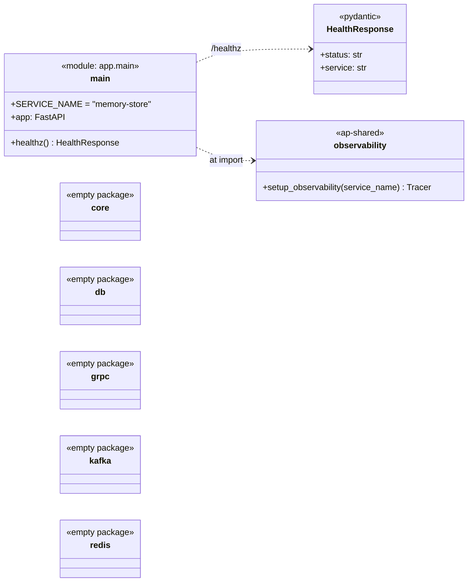
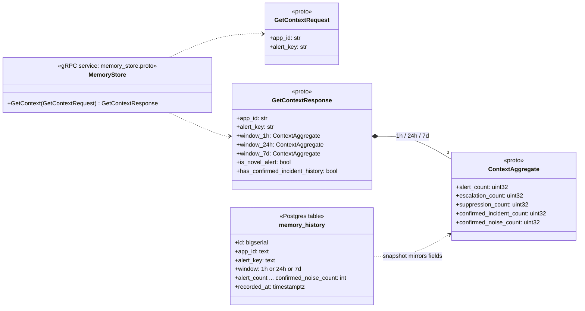

# memory-store — class diagram

**Status: skeleton only.** Through Day 5 of `docs/plan.md`, `memory-store`
has a FastAPI app with `/healthz` and nothing else. The `core/`, `db/`,
`grpc/`, `kafka/` and `redis/` packages are empty `__init__.py` stubs. It
is built on Day 6, and Day 10 adds the verdict feedback loop.

## As built today

- **`main`**: creates the FastAPI app at import time, calls
  `setup_observability("memory-store")`, and serves `GET /healthz`.
- **`HealthResponse`**: the `{status, service}` body that Compose health
  checks poll.

## Contracts already in the repo (implementation pending)

Two contracts this service must serve are already committed.

The **gRPC API** is in `backend/proto/memory_store.proto`, and its stubs
are generated in `ap-shared` (`proto_gen.memory_store_pb2*`).

The **durable table** is `memory_history`, in
`backend/local/postgres/init.sql`.

- **`GetContextRequest`**: looks up one `alert_key` within one app.
  `app_id` scopes it, so the same key in two apps never collides.
- **`ContextAggregate`**: counts over one rolling window.
  - The platform's own decisions: alerts, escalations, suppressions.
  - Analyst verdicts fed back from `verdict.recorded` (Day 10): confirmed
    incidents and confirmed noise.
- **`GetContextResponse`**: three windows, plus `is_novel_alert` and the
  window-independent `has_confirmed_incident_history`. From Day 7,
  `escalate_when` guardrails can reference these fields.
- **`memory_history`**: a durable snapshot written on every update, so
  Redis can be rebuilt from it on a cache miss.

### Planned design (from `docs/plan.md` Days 6 and 10)

- `GetContext` reads Redis (keys prefixed by `app_id`/`memory_namespace`).
  On a miss it computes from Postgres and repopulates Redis.
- The Kafka consumer reads `alert.decided`, updating decision counts, and
  from Day 10 `verdict.recorded`, updating the confirmed counts and the
  incident-history flag.
- `orchestrator` calls `GetContext` synchronously over gRPC before the
  agent runs (Day 7).

Update this file with the real classes when Day 6 lands.
