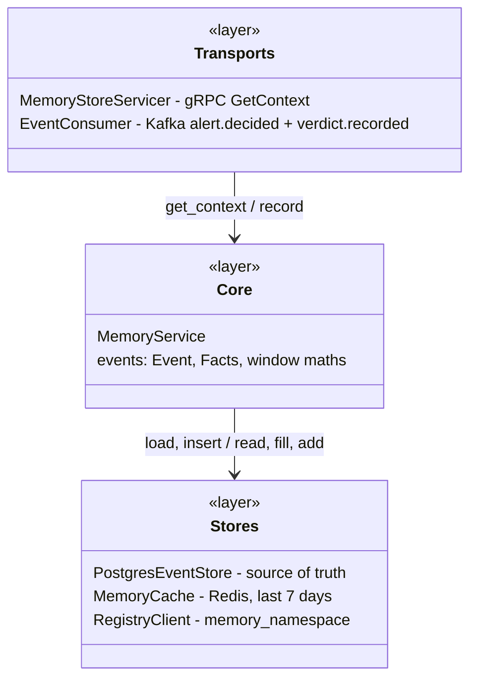
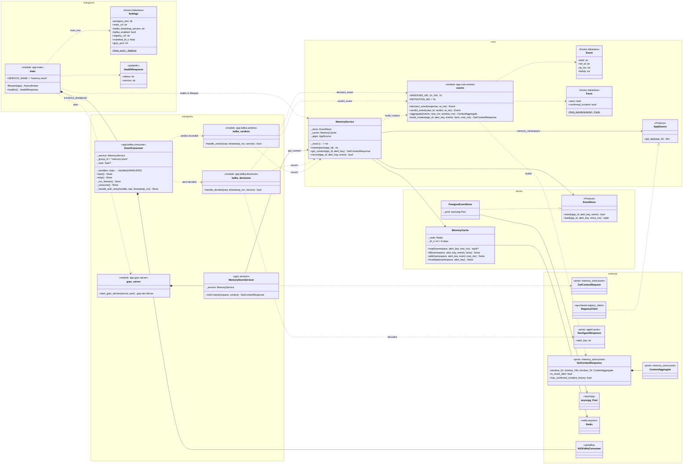
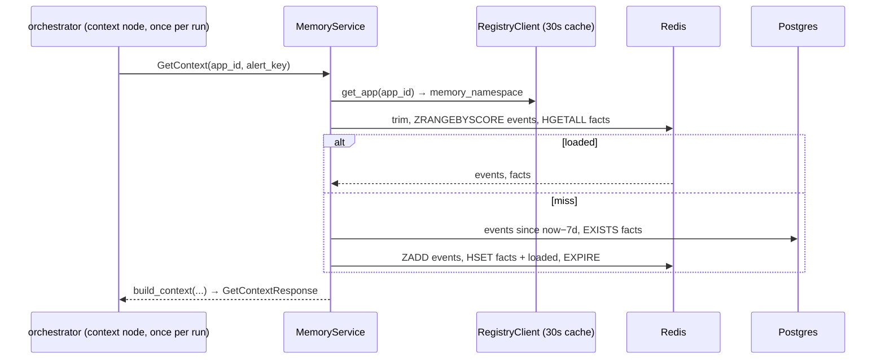
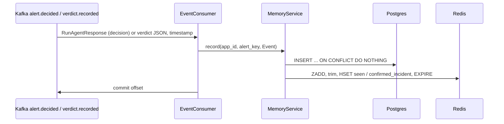

# memory-store — class diagram

As built through Day 10 of `docs/plan.md`. `memory-store` answers one
question for `orchestrator`: *what has this platform seen and decided for
this `alert_key` lately, and what did analysts say about it?* It serves
gRPC `GetContext` (1h/24h/7d decision and verdict counts, `is_novel_alert`,
`has_confirmed_incident_history`), built from an event log it fills by
consuming `alert.decided` (ADR-0016, ADR-0017) and, since Day 10,
`verdict.recorded`.

Python modules that are plain functions (no class) are drawn as
`<<module>>` boxes. Third-party and cross-service types are in the
`external` group.

## Overview: layers

Both transports go through `MemoryService`. Window counts are computed in
one pure function from a list of events, whether those came from Redis or
Postgres, so the cache and a rebuild always agree.

## Full class diagram

## Classes and modules

### Entry point — `app/main.py`, `app/core/config.py`

**`lifespan()`** builds everything at startup: an asyncpg pool
(`POSTGRES_DSN`), a Redis client (`REDIS_URL`, `decode_responses=True`), a
`RegistryClient` (`REGISTRY_URL`, `MANIFEST_TTL_S`), then the
`MemoryService`. It starts the gRPC server on `GRPC_PORT` (50051; Compose
publishes it as 50053) and, unless `KAFKA_ENABLED=false`, the
`EventConsumer`. On shutdown it stops all of them in reverse. HTTP serves
only `/healthz`.

**`Settings`**: frozen dataclass from the environment, with defaults that
point at the Compose stack from the host.

### Core — `app/core/events.py`

**`Event`**: one thing that happened to an `alert_key`.
- `kind`: `decision:<Decision>` (e.g. `decision:SUPPRESS`), or
  `verdict:CONFIRMED_INCIDENT` / `verdict:CONFIRMED_NOISE`.
- `ref_id`: what it's about (the `alert_id` for a decision, the `case_id`
  for a verdict, so each case counts one verdict). `family` is
  the part of `kind` before `:`; (`app_id`, family, `ref_id`) is unique.
- `at_ms`: when it happened (the Kafka message timestamp, for both kinds).

**`Facts`**: the two all-time facts that outlive the 7-day window: `seen`
(any decision ever) and `confirmed_incident` (any confirmed-incident
verdict ever).

**Window maths** (module functions):
- `aggregate(events, now_ms, window_ms)` counts one window, `(now − w,
  now]`. An event exactly `w` old is out; an event stamped after `now`
  (clock skew) counts. Every decision is an alert; ESCALATE and SUPPRESS
  also count in their own fields; AUTO_RESOLVE and "not evaluated"
  (`DECISION_UNSPECIFIED`) count as alerts only.
- `build_context(...)` builds the full `GetContextResponse`: the three
  windows, `is_novel_alert = not facts.seen`,
  `has_confirmed_incident_history = facts.confirmed_incident`.
- `decision_event(response, at_ms)` turns an `alert.decided` message into
  an `Event`.

### Core — `app/core/service.py`

**`MemoryService`**: the two operations.
- `namespace(app_id)`: `memory_namespace` from `registry` through the
  shared cached client (ADR-0018). Raises `AppNotFoundError` /
  `RegistryUnavailableError`.
- `get_context(app_id, alert_key)`: Redis `read`; on a miss, Postgres
  `load` (last 7 days + facts), then Redis `fill`. If Redis raises, it
  answers from Postgres without caching.
- `record(app_id, alert_key, event)`: Postgres `insert` first (returns
  False for a duplicate), then Redis `add`. If the add fails, the key is
  invalidated so the next read rebuilds it. An app missing from `registry`
  is stored but not cached; `registry` being down propagates so the
  consumer retries.

`AppSource` is the Protocol `RegistryClient` satisfies; tests use a fake.
`clock` is injectable so tests can move time.

### Stores — `app/db/postgres.py`, `app/redis/cache.py`

**`PostgresEventStore`** (the `EventStore` Protocol) over `memory_events`
(`backend/local/postgres/init.sql`):
- `insert`: `INSERT … ON CONFLICT (app_id, family, ref_id) DO NOTHING`.
- `load`: events with `occurred_at > since`, plus the two facts as
  `EXISTS` queries, in one read-only repeatable-read transaction.

**`MemoryCache`**: two Redis keys per `{memory_namespace}:{alert_key}`.

| Key | Type | Content |
|---|---|---|
| `mem:{ns}:{key}:events` | sorted set | member `{kind}\|{ref_id}`, score = `at_ms`; last 7 days |
| `mem:{ns}:{key}:facts` | hash | `seen`, `confirmed_incident` (present only when true), `loaded` |

- `read` trims events older than 7 days, then returns events + facts, or
  `None` when `loaded` is absent (a miss).
- `fill` stores a Postgres rebuild and sets `loaded`.
- `add` adds one event, trims, and sets any fact it makes true.
- `invalidate` deletes both keys.

Every write only adds, so a rebuild racing a new event ends with the union
rather than losing the event. Both keys get an 8-day TTL on every touch;
idle keys expire and are rebuilt on demand.

### Transports — `app/grpc/server.py`, `app/kafka/`

**`MemoryStoreServicer.GetContext`**: missing `app_id`/`alert_key` →
`INVALID_ARGUMENT`; unknown app → `NOT_FOUND`; `registry` down with
nothing cached, or Postgres down → `UNAVAILABLE`. Redis being down is not
an error.

**`handle_decided(raw, timestamp_ms, service)`**: decodes a
`RunAgentResponse` and records `decision_event(response, timestamp)`.
Undecodable messages, or ones missing `app_id`/`alert_id`/`alert_key`
(every message from before ADR-0016), are logged and skipped.

**`handle_verdict(raw, timestamp_ms, service)`**: parses
`review-console`'s JSON (`{app_id, case_id, alert_key, verdict,
verdict_by, recorded_at}`) and records `verdict_event(str(case_id),
verdict, timestamp)`. Not JSON, a missing `app_id`/`alert_key`/`case_id`,
or a verdict other than `CONFIRMED_INCIDENT`/`CONFIRMED_NOISE`: logged and
skipped. `verdict_by` and `recorded_at` aren't stored.

**`EventConsumer`**: consumer group `memory-store` on both topics
(`HANDLERS` maps each to its handler), from the earliest offset, one
message at a time, offset committed after the event is stored. A failed
handler (registry or Postgres down) is retried with backoff (0.5 s → 10 s)
and never skipped. It reconnects to Kafka every 2 s while Kafka is down.

## Flows

**`GetContext`**

**Recording a decision or a verdict**

## Design notes

- **Event log, not snapshots** (ADR-0017): a sliding window can be
  recomputed from events at any moment; a snapshot of a window can't.
- **Postgres is the truth, Redis a cache of it**: a lost Redis only costs
  latency (cold miss ~2 ms vs ~0.5 ms warm, Day 6 measurement).
- **Idempotent by design**: duplicate Kafka deliveries hit the unique
  constraint and the sorted-set member, so they never double-count.
- **Namespaced by app** (ADR-0018): the same `alert_key` in two apps never
  shares a Redis key; Postgres rows carry `app_id`.
- **Callers**: since Day 7 `orchestrator` calls `GetContext` once per run,
  before the agent (ADR-0019); the response is the agent's
  `memory_context` block, the supervisor's input, and what `context.*`
  guardrails read. A failed call doesn't stop the run: the supervisor
  caps confidence at 0.5 instead.
- **Next changes**: none planned for the service itself; a retention job
  for old `memory_events` rows is not in this build (ADR-0017).
