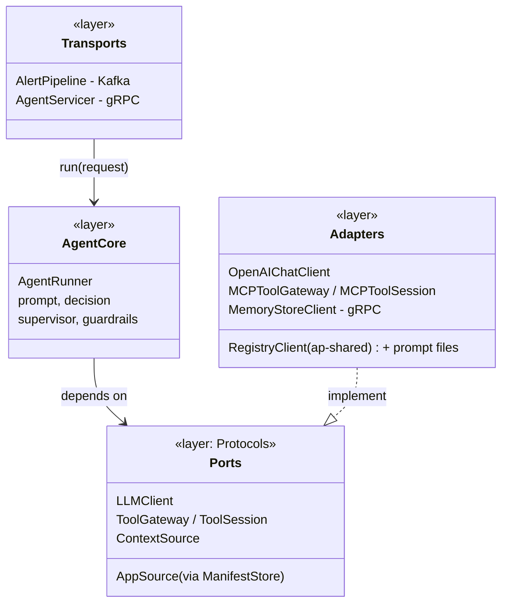

# orchestrator — class diagram

As built through Day 7 of `docs/plan.md`. `orchestrator` runs the agents.
It takes a `RunAgentRequest` (from Kafka `alert.received`, or the gRPC
`RunAgent` call), resolves the app's manifest from `registry` and the
prompt from its image, fetches the alert_key's history from `memory-store`
over gRPC, runs an LLM tool-calling loop against `tool-gateway` over MCP,
then applies the supervisor and the `escalate_when` guardrails, and returns
a `RunAgentResponse` with a decision, a confidence, `reasons[]` and the
tool-call trace.

Python modules that are plain functions (no class) are drawn as
`<<module>>` boxes. Third-party and cross-service types are in the
`external` group.

## Overview: layers



Both transports call the same `AgentRunner.run()`. The runner talks only
to provider-neutral interfaces, never to OpenAI or MCP directly. Adapters
sit behind them and are chosen in `main.py`. The supervisor and
guardrails are pure functions the runner calls after the loop.

## Full class diagram

```mermaid
classDiagram
    direction LR

    namespace entrypoint {
        class main {
            <<module>>
            +SERVICE_NAME = "orchestrator"
            +build_llm(settings) LLMClient
            +build_runner(settings, registry, memory) AgentRunner
            -lifespan(app) AsyncIterator
            +healthz() HealthResponse
        }
        class Settings {
            <<frozen dataclass>>
            +apps_dir: Path
            +tool_gateway_url: str
            +registry_url: str
            +memory_store_target: str
            +memory_store_timeout_s: float
            +min_confidence: float
            +manifest_ttl_s: float
            +kafka_bootstrap_servers: str
            +kafka_enabled: bool
            +grpc_port: int
            +llm_provider: str
            +llm_model: str
            +max_tool_rounds: int
            +from_env()$ Settings
        }
    }

    namespace transports {
        class AlertPipeline {
            -_runner: AgentRunner
            -_received_topic: str
            -_decided_topic: str
            -_group_id: str
            -_task: Task?
            +start() None
            +stop() None
            -_run_forever() None
            -_consume() None
        }
        class kafka_alerts {
            <<module: app.kafka.alerts>>
            +handle_alert(raw, runner) tuple?
            +message_key(app_id, alert_key) bytes
        }
        class AgentServicer {
            <<grpc servicer>>
            -_runner: AgentRunner
            +RunAgent(request, context) RunAgentResponse
        }
        class grpc_server {
            <<module: app.grpc.server>>
            +start_grpc_server(runner, port) grpc.aio.Server
        }
    }

    namespace agent {
        class AgentRunner {
            -_manifests: ManifestStore
            -_gateway: ToolGateway
            -_llm: LLMClient
            -_memory: ContextSource
            -_max_tool_rounds: int
            -_min_confidence: float
            +run(request) RunAgentResponse
            -_get_context(app_id, alert_key) tuple
            -_run(request, manifest, agent, app_prompt, context, tools, memory_context, memory_error) RunAgentResponse
            -_call_tool(tools, call, allowed, context) ToolResult
        }
        class loop {
            <<module: app.agent.loop>>
            +INFRA_TOOL_ERRORS
            +summarize(result) str
            +not_evaluated_response(request, why) RunAgentResponse
        }
        class prompt {
            <<module: app.agent.prompt>>
            +PLATFORM_RULES: str
            +new_nonce() str
            +build_system_prompt(app_prompt, nonce) str
            +data_block(kind, content, nonce) str
            +alert_data(request) dict
            +context_data(context) dict
            +alert_message(request, context, nonce) str
            +tool_result_message(tool_name, result, nonce) str
        }
        class decision {
            <<module: app.agent.decision>>
            +parse_decision(text) ParsedDecision
        }
        class _FinalAnswer {
            <<pydantic>>
            +decision: str
            +confidence: float 0-1, strict
            +reasons: list~str~
        }
        class ParsedDecision {
            <<frozen dataclass>>
            +decision: Decision
            +confidence: float
            +reasons: list~str~
        }
        class DecisionParseError {
            <<exception: ValueError>>
        }
        class supervisor {
            <<module: app.agent.supervisor>>
            +NO_CONTEXT_CAP = 0.5
            +NOVEL_ALERT_CAP = 0.5
            +CONFIRMED_INCIDENT_SUPPRESS_CAP = 0.3
            +caps(decision, context) list
            +supervise(decision, agent_confidence, context, min_confidence) Supervised
        }
        class Supervised {
            <<frozen dataclass>>
            +decision: Decision
            +confidence: float
            +reason: str?
        }
        class guardrails {
            <<module: app.agent.guardrails>>
            +ENVELOPE_FIELDS
            +MISSING
            +evaluate(rules, request, context) list~Match~
            +lookup(field, request, payload, context) value
            +equal(value, allowed) bool
        }
        class Rule {
            <<frozen dataclass>>
            +field: str
            +values: list
        }
        class Match {
            <<frozen dataclass>>
            +index: int
            +rule: Rule
            +value: scalar
            +describe() str
        }
    }

    namespace memory_port {
        class ContextSource {
            <<Protocol>>
            +get_context(app_id, alert_key) GetContextResponse
        }
        class MemoryStoreClient {
            -_channel: grpc.aio.Channel
            -_stub: MemoryStoreStub
            -_timeout_s: float
            +get_context(app_id, alert_key) GetContextResponse
            +aclose() None
        }
        class ContextUnavailableError {
            <<exception: RuntimeError>>
        }
    }

    namespace llm_port {
        class LLMClient {
            <<Protocol>>
            +model: str
            +complete(system, messages, tools) LLMResponse
        }
        class LLMResponse {
            <<frozen dataclass>>
            +text: str?
            +tool_calls: tuple~ToolCallRequest~
            +usage: Usage
        }
        class Usage {
            <<frozen dataclass>>
            +input_tokens: int
            +output_tokens: int
        }
        class ToolDefinition {
            <<frozen dataclass>>
            +name: str
            +description: str
            +input_schema: dict
        }
        class ToolCallRequest {
            <<frozen dataclass>>
            +id: str
            +name: str
            +arguments: dict?
            +raw_arguments: str
        }
        class Message {
            <<union type>>
            UserMessage or AssistantMessage or ToolResultMessage
        }
        class UserMessage {
            <<frozen dataclass>>
            +content: str
        }
        class AssistantMessage {
            <<frozen dataclass>>
            +content: str?
            +tool_calls: tuple~ToolCallRequest~
        }
        class ToolResultMessage {
            <<frozen dataclass>>
            +tool_call_id: str
            +content: str
        }
        class LLMError {
            <<exception>>
        }
        class OpenAIChatClient {
            +model: str
            -_client: AsyncOpenAI
            +complete(system, messages, tools) LLMResponse
        }
        class openai_llm {
            <<module: app.agent.openai_llm>>
            +to_openai_tool(tool) dict
            +to_openai_message(message) dict
            +from_openai_response(response) LLMResponse
        }
    }

    namespace tools_port {
        class ToolGateway {
            <<Protocol>>
            +connect() AsyncContextManager~ToolSession~
        }
        class ToolSession {
            <<Protocol>>
            +call_tool(name, arguments, context) ToolResult
        }
        class MCPToolGateway {
            -_server: str or Server
            +connect() AsyncIterator~MCPToolSession~
        }
        class MCPToolSession {
            -_client: mcp.Client
            +list_tools() list~GatewayTool~
            +call_tool(name, arguments, context) ToolResult
        }
        class GatewayTool {
            <<frozen dataclass>>
            +name: str
            +description: str
            +input_schema: dict
            +version: str
            +scope: str
            +app_id: str?
        }
        class ToolResult {
            <<frozen dataclass>>
            +is_error: bool
            +content: dict
            +error_code: str?
        }
    }

    namespace manifest_port {
        class ManifestStore {
            -_registry: AppSource
            -_apps_dir: Path
            +get(app_id) AppManifest
            +prompt(manifest, agent) str
        }
        class AppSource {
            <<Protocol>>
            +get_app(app_id) dict
        }
        class AppManifest {
            <<pydantic, extra=ignore>>
            +app_id: str
            +display_name: str
            +agents: list~AgentSpec~
            +memory_namespace: str
            +escalate_when: list~EscalateRule~
            +supervisor: SupervisorSpec?
            +agent(agent_id) AgentSpec
            +guardrails() list~Rule~
            +min_confidence(default) float
        }
        class EscalateRule {
            <<pydantic, extra=ignore>>
            +field: str
            +in_: list alias "in"
            +rule() Rule
        }
        class SupervisorSpec {
            <<pydantic, extra=ignore>>
            +min_confidence: float? 0-1
        }
        class AgentSpec {
            <<pydantic, extra=ignore>>
            +agent_id: str
            +version: str
            +role: str
            +prompt_ref: str
            +tool_allowlist: list~str~
            +invoke_on: list~str~
            +tools: list~AgentTool~
        }
        class AgentTool {
            <<pydantic, extra=ignore>>
            +tool_id: str
            +version: str
            +scope: str
            +description: str
            +input_schema: dict
        }
        class ResolutionError {
            <<exception: LookupError>>
        }
        class ManifestUnavailableError {
            <<exception: RuntimeError>>
        }
    }

    namespace external {
        class RunAgentRequest {
            <<proto: agent.proto>>
        }
        class RunAgentResponse {
            <<proto: agent.proto>>
            +alert_key: str
            +decision: Decision
            +confidence: float
            +reasons: list~str~
            +tool_calls: list~ToolCall~
        }
        class GetContextResponse {
            <<proto: memory_store.proto>>
            +window_1h/24h/7d: ContextAggregate
            +is_novel_alert: bool
            +has_confirmed_incident_history: bool
        }
        class RunContext {
            <<ap-shared run_context>>
            +app_id: str
            +agent_id: str
            +alert_id: str
            +to_meta() dict
        }
        class AgentServicerBase {
            <<proto_gen agent_pb2_grpc>>
        }
        class AIOKafka {
            <<aiokafka Consumer + Producer>>
        }
        class RegistryClient {
            <<ap-shared registry_client>>
            +get_app(app_id) dict
            +aclose() None
        }
        class AppNotFoundError {
            <<ap-shared registry_client>>
        }
        class RegistryUnavailableError {
            <<ap-shared registry_client>>
        }
    }

    %% composition root
    main ..> Settings
    main ..> AgentRunner : build_runner
    main ..> OpenAIChatClient : build_llm
    main ..> MCPToolGateway : build_runner
    main ..> ManifestStore : build_runner
    main ..> RegistryClient : lifespan, closes on shutdown
    main ..> MemoryStoreClient : lifespan, one channel, closes on shutdown
    main *-- AlertPipeline : lifespan
    main ..> grpc_server : lifespan

    %% transports
    AlertPipeline --> AgentRunner
    AlertPipeline ..> kafka_alerts : handle_alert
    AlertPipeline *-- AIOKafka
    kafka_alerts ..> AgentRunner : run
    kafka_alerts ..> loop : not_evaluated_response
    grpc_server *-- AgentServicer
    AgentServicer --|> AgentServicerBase
    AgentServicer --> AgentRunner
    AgentServicer ..> loop : not_evaluated_response

    %% memory port
    MemoryStoreClient ..|> ContextSource
    MemoryStoreClient ..> ContextUnavailableError : raises on any RPC error
    MemoryStoreClient ..> GetContextResponse
    AgentRunner ..> ContextUnavailableError : catches, runs without context

    %% agent core
    AgentRunner --> ManifestStore
    AgentRunner --> ToolGateway
    AgentRunner --> LLMClient
    AgentRunner --> ContextSource : once per run, before the loop
    AgentRunner ..> supervisor : step 2
    AgentRunner ..> guardrails : step 3
    supervisor ..> Supervised : returns
    supervisor ..> GetContextResponse : reads flags
    guardrails ..> Match : returns
    guardrails ..> Rule : evaluates
    guardrails ..> GetContextResponse : context.*
    guardrails ..> RunAgentRequest : alert.*, payload.*
    prompt ..> GetContextResponse : memory_context block
    AgentRunner ..> prompt : builds messages
    AgentRunner ..> decision : parse final answer
    AgentRunner ..> loop : summarize
    AgentRunner ..> RunContext : per run
    AgentRunner ..> RunAgentRequest : input
    AgentRunner ..> RunAgentResponse : output
    decision ..> _FinalAnswer : validates
    decision ..> ParsedDecision : returns
    decision ..> DecisionParseError : raises
    prompt ..> RunAgentRequest : reads

    %% llm port
    OpenAIChatClient ..|> LLMClient
    OpenAIChatClient ..> openai_llm : translates
    OpenAIChatClient ..> LLMError : raises
    LLMClient ..> LLMResponse
    LLMClient ..> ToolDefinition
    LLMClient ..> Message
    LLMResponse *-- Usage
    LLMResponse *-- ToolCallRequest
    Message <|-- UserMessage
    Message <|-- AssistantMessage
    Message <|-- ToolResultMessage
    AssistantMessage *-- ToolCallRequest

    %% tools port
    MCPToolGateway ..|> ToolGateway
    MCPToolSession ..|> ToolSession
    MCPToolGateway ..> MCPToolSession : yields per run
    MCPToolSession ..> GatewayTool : list_tools (not used by the loop)
    ToolSession ..> ToolResult
    MCPToolSession ..> RunContext : to_meta in _meta

    %% manifest
    ManifestStore --> AppSource
    RegistryClient ..|> AppSource
    ManifestStore ..> AppManifest : validates GET /apps result
    ManifestStore ..> ResolutionError : raises (unknown app, bad prompt_ref)
    ManifestStore ..> ManifestUnavailableError : raises (registry down)
    ManifestStore ..> AppNotFoundError : catches
    ManifestStore ..> RegistryUnavailableError : catches
    AppManifest *-- AgentSpec
    AppManifest *-- EscalateRule
    AppManifest *-- SupervisorSpec
    EscalateRule ..> Rule : rule()
    AgentSpec *-- AgentTool
    AppManifest ..> ResolutionError : raises
    AgentRunner ..> AgentTool : ToolDefinitions
```



## Classes and modules

### Entry point — `app/main.py`, `app/core/config.py`

**`main` (module)** is the composition root.
- `build_llm()` picks the LLM adapter from `LLM_PROVIDER`. Only `openai`
  exists, imported lazily so tests never need the SDK configured.
- `build_runner()` wires an `AgentRunner` from a `ManifestStore` (over the
  `RegistryClient`), the MCP gateway client, the LLM, the
  `MemoryStoreClient` and the default `MIN_CONFIDENCE`.
- `lifespan()` builds everything at startup, not at import, because the
  OpenAI client needs `OPENAI_API_KEY` and tests import `main` without one.
  It creates the `RegistryClient` (`REGISTRY_URL`, `MANIFEST_TTL_S`) and
  the `MemoryStoreClient` (one channel for the process's lifetime), then
  starts the gRPC server and, if `KAFKA_ENABLED`, the `AlertPipeline`, and
  stops and closes them all on shutdown.
- `/healthz` is the only HTTP route.

**`Settings`**: frozen dataclass read from the environment:
- `TOOL_GATEWAY_URL`, `KAFKA_BOOTSTRAP_SERVERS`, `GRPC_PORT`;
- `REGISTRY_URL` (default `http://localhost:8005`), `MANIFEST_TTL_S`
  (default 30, the same as `ingestion` and `tool-gateway`);
- `MEMORY_STORE_TARGET` (default `localhost:50053`; Compose sets
  `memory-store:50051`), `MEMORY_STORE_TIMEOUT_S` (default 1);
- `MIN_CONFIDENCE` (default 0.6): the supervisor threshold for apps whose
  manifest sets none;
- `APPS_DIR` (where prompt files are read from);
- `LLM_PROVIDER`, `LLM_MODEL`;
- `MAX_TOOL_ROUNDS` (default 5).

The API key is deliberately not here: the provider SDK reads it, so the
key never passes through platform code.

### Transports — `app/kafka/alerts.py`, `app/grpc/server.py`

Two ways in, one behaviour. Both turn a failed run into an `ESCALATE`
answer rather than silence.

**`handle_alert()` (`kafka_alerts` module)**: decodes one `alert.received`
message.
- An undecodable message, or one missing `app_id`/`alert_id`, is logged
  and skipped (returns `None`). There is no `alert_id` to answer for, and
  the DLQ arrives on Day 16.
- Otherwise it calls `AgentRunner.run()`. A `ResolutionError`, an
  `LLMError`, a `ManifestUnavailableError` ("registry unavailable") or any
  other exception becomes `not_evaluated_response()`.

Every decodable alert gets exactly one `alert.decided`.

**`AlertPipeline`**: the Kafka loop.
- It consumes in the `orchestrator` group, one message at a time, with
  auto-commit off.
- It publishes the decision with an idempotent producer (`acks=all`),
  keyed `{app_id}:{alert_key}`.
- It commits the offset only after that publish, so a crash re-runs the
  alert instead of losing it.
- `_run_forever()` reconnects every 2s while Kafka is down, so `/healthz`
  stays green.
- Topic and group names are constructor parameters so the integration
  test can isolate itself.

**`AgentServicer`**: the gRPC `Agent.RunAgent` implementation, subclassing
the generated `agent_pb2_grpc.AgentServicer`.
- An unknown app or agent (`ResolutionError`) aborts with `NOT_FOUND`,
  because it is the caller's error.
- An LLM failure, `registry` being unreachable, or any other error returns
  an `ESCALATE` "not evaluated" response, the same as the Kafka path.

**`start_grpc_server()`** registers the servicer on an insecure port
(plaintext inside the platform network, ARCHITECTURE §13 T12).

### Agent core — `app/agent/loop.py`, `prompt.py`, `decision.py`, `supervisor.py`, `guardrails.py`

**`AgentRunner`**: the heart of the service. It is app-agnostic: the
prompt and tools come from the manifest.

`run(request)`:
1. Resolves (awaits) the `AppManifest` from `registry`, the `AgentSpec`
   (the entry agent when `agent_id` is empty) and the prompt text.
2. Builds a `RunContext`.
3. Opens an `agent.run` span, fetches the memory context
   (`_get_context`, in a `memory.get_context` span; a
   `ContextUnavailableError` becomes "no context" plus the error text),
   opens one MCP session for the whole run, then delegates to `_run`.

`_run(...)` is the tool-calling loop:
1. Turns the agent's `tools` (resolved by `registry`: allowlisted,
   declared, enabled) into `ToolDefinition`s. It no longer calls
   `tools/list` on `tool-gateway`.
2. Builds the system prompt (platform rules plus app prompt) and the first
   user message (the alert and the memory context as two data blocks),
   using a fresh nonce.
3. Runs up to `max_tool_rounds + 1` LLM calls:
   - **No tool calls**: the answer is final. `parse_decision()` it; a
     parse failure becomes `ESCALATE` with a reason and confidence 0.
   - **Tool calls**: run each through `_call_tool`, add a `ToolCall`
     (name plus a 300-char result summary) to the trace, and feed the
     result back as a data block.
4. If the rounds run out, the decision is `ESCALATE`.

The inner `respond()` closure applies the decision order
(ARCHITECTURE §5) and builds the `RunAgentResponse`:
1. If memory context was unavailable, it adds a reason saying so. If any
   tool failed for an infrastructure reason (`tool_failed`,
   `registry_unavailable`, `gateway_unreachable`), it forces `ESCALATE`
   and adds a reason: the agent decided without that evidence.
2. `supervise()` with the manifest's threshold (else the default); its
   reason, if it escalated, is added.
3. `guardrails.evaluate()` with the manifest's rules; each match adds a
   reason naming the rule, and forces `ESCALATE` if the decision wasn't
   already.

It sets `confidence` to the supervised value and logs it with token usage.

`_call_tool(...)` is the first allowlist check. A tool the agent wasn't
offered returns `tool_not_allowed` without reaching `tool-gateway`, and
non-object arguments return `invalid_arguments`. Otherwise it calls the
tool inside an `agent.tool_call` span, passing `RunContext`.

**`loop` (module functions)**:
- `summarize()` builds the compact `result_summary` for the trace.
- `not_evaluated_response()` is the `ESCALATE` answer used when a run
  couldn't happen at all.

`INFRA_TOOL_ERRORS` is the set of error codes that force escalation.

**`prompt` (module)**: prompt assembly and the prompt-injection boundary.
- `PLATFORM_RULES` is the platform's fixed instructions. They explain the
  data blocks and the memory context (the platform's own decision counts
  are context, never evidence of noise; only analyst verdicts are, §13
  T3), say tools are read-only, and require the exact JSON final-answer
  format, including `confidence`.
- `data_block()` wraps any outside content (the alert, tool results) as
  pretty-printed JSON between `<<<DATA {nonce} kind=...>>>` and
  `<<<END DATA {nonce}>>>`. The nonce is random per run
  (`new_nonce()`, 16 hex chars), so data can't forge the end marker.
- `alert_data()` and `alert_message()` render the envelope and the
  decoded `payload` Struct.
- `context_data()` renders a `GetContextResponse` with every window
  (zeros included) and both flags, minus `app_id`; with no context it is
  `{"available": false}`.
- `tool_result_message()` wraps a tool's output.

**`decision` (module)**: `parse_decision(text)` turns the final answer into
a `ParsedDecision`.
- It strips an optional ```` ```json ```` fence.
- It validates against **`_FinalAnswer`**: `decision` is one of
  `AUTO_RESOLVE`/`ESCALATE`/`SUPPRESS`, `confidence` is a number from 0
  to 1 (strict: not a string, not a boolean), and `reasons` is non-empty.
- It trims to at most 10 reasons of 500 chars each.
- Anything else raises **`DecisionParseError`**. It never guesses a
  decision; the caller escalates.

**`ParsedDecision`** holds the proto `Decision` enum value, the agent's
confidence and the cleaned reasons.

**`supervisor` (module, ADR-0020)**: code, not an agent or a tool.
- `caps()` lists the fixed caps that apply: no context 0.5; a novel
  `alert_key` 0.5 unless the decision is `ESCALATE`; `SUPPRESS` with
  confirmed-incident history 0.3.
- `supervise()` takes the minimum of the agent's confidence and those
  caps. Below the threshold, a non-`ESCALATE` decision becomes
  `ESCALATE`, and **`Supervised.reason`** gives the value, the threshold
  and which cap (or "the agent's own estimate"). `ESCALATE` is never
  changed.

**`guardrails` (module, ADR-0010/0021)**: `evaluate()` returns a **`Match`**
for every **`Rule`** that matches, in manifest order.
- `lookup()` reads `alert.<envelope field>` (`ENVELOPE_FIELDS`: source,
  severity, message, alert_key), `payload.<path>` (from the decoded
  `Struct`) or `context.<path>` (walking the `GetContextResponse`
  descriptor). Anything missing, non-scalar, or `context.*` with no
  context is `MISSING`, which never matches.
- `equal()` is type-strict: booleans only equal booleans, numbers compare
  by value (`3 == 3.0`), strings exactly.
- `Match.describe()` gives the reason text, e.g.
  `escalate_when[0] alert.severity = "critical"`.

### Memory port — `app/memory/client.py`

**`ContextSource` (Protocol)**: `get_context(app_id, alert_key)`. Tests use
a `FakeMemory`.

**`MemoryStoreClient`** (ADR-0019): one `grpc.aio` insecure channel and
`MemoryStoreStub`, opened at startup and reused for every call; gRPC
reconnects it after `memory-store` restarts. Each call has a deadline
(`MEMORY_STORE_TIMEOUT_S`). Any `AioRpcError` (unreachable, deadline,
`NOT_FOUND`, `INVALID_ARGUMENT`, ...) is logged and raised as
**`ContextUnavailableError`**, which the runner turns into "run without
context".

### LLM port — `app/agent/llm.py`, `openai_llm.py`

**`LLMClient` (Protocol)**: the only LLM interface the loop knows. It has
one method, `complete(system, messages, tools)`, returning an
`LLMResponse`. This is the seam for other providers and for a per-agent
`model_ref` later (ADR-0015).

**Value types** (all frozen dataclasses):
- `ToolDefinition`: what the model may call.
- `ToolCallRequest`: what it asked to call. `arguments` is `None` when the
  model's JSON wasn't an object; `raw_arguments` is kept so it can be
  replayed exactly.
- `UserMessage`, `AssistantMessage` (text plus tool calls) and
  `ToolResultMessage`: the conversation, combined as the `Message` union.
- `LLMResponse`: text, tool calls and `Usage` (input/output tokens).

**`LLMError`** covers any provider failure: network, auth, rate limit or a
bad response.

**`OpenAIChatClient`**: the OpenAI adapter, and the only module that
imports `openai`. It uses Chat Completions with function tools, a 60s
timeout and 2 SDK retries. It maps `openai.OpenAIError` to `LLMError`. An
injected `client` lets tests run against a fake.

**`openai_llm` (module functions)**: the translators, using `match` on the
message type:
- `to_openai_tool` and `to_openai_message` convert outgoing data;
- `from_openai_response` converts the reply. It rejects empty choices and
  non-function tool calls.

### Tools port — `app/tools/gateway.py`

**`ToolGateway` / `ToolSession` (Protocols)**: `connect()` opens a session
for one agent run; the loop only needs `call_tool()` on it. Tests use an
in-process MCP server or fakes.

**`MCPToolGateway`**: holds `tool-gateway`'s URL, or an in-process MCP
`Server` in tests. `connect()` opens an `mcp.Client` and yields an
`MCPToolSession`.

**`MCPToolSession`**: the MCP calls.
- `list_tools()` maps MCP tools to `GatewayTool`, reading `version`,
  `scope` and `app_id` from the tool's `_meta`. Since Day 5 the loop
  doesn't use it (tool definitions come from `registry`); it stays as a
  tested client method.
- `call_tool()` sends the arguments with `RunContext.to_meta()` as the
  request `_meta`, never as an argument. Any transport exception becomes
  `gateway_unreachable`. A text-only reply is parsed as JSON. An error
  with no code gets `tool_failed`.

**`GatewayTool`**: the tool metadata `list_tools()` returns.

**`ToolResult`**: `is_error` plus a `content` dict. Its `error_code`
property reads `content["error"]`.

### Manifest — `app/core/manifest.py`

**`ManifestStore`**: resolves an app through an **`AppSource`** (the
`ap-shared` `RegistryClient` in production, a dict-backed fake in tests).
- `get(app_id)` (async) calls `get_app()`, which is `GET /apps/{app_id}`
  behind the shared 30s TTL cache, validates the result into
  `AppManifest`, and checks the returned `app_id`. `AppNotFoundError`
  becomes `ResolutionError`; `RegistryUnavailableError` (registry down and
  nothing cached) becomes `ManifestUnavailableError`.
- `prompt(manifest, agent)` reads the agent's `prompt_ref` from
  `APPS_DIR/{app_id}/`, which is in the image, refusing paths outside the
  app folder (`ResolutionError`).

**`AppManifest`**: the fields `orchestrator` uses (`app_id`,
`display_name`, `agents`, `memory_namespace`, `escalate_when`,
`supervisor`). `extra="ignore"`, so fields `registry` adds later don't
break an older build. `agent(agent_id)` returns the named agent, or the
`entry` agent when `agent_id` is empty. `guardrails()` turns the
**`EscalateRule`**s (`field`, `in`) into `Rule`s; `min_confidence(default)`
reads **`SupervisorSpec`**, falling back to the default when the manifest
sets none.

**`AgentSpec`**: one agent's `agent_id`, `version`, `role`
(`entry`/`callable`), `prompt_ref`, `tool_allowlist`, `invoke_on` (used
from Day 8), and **`tools`**: the `AgentTool`s `registry` resolved
(allowlisted, declared, enabled), each with the description and input
schema the LLM is given.

**`ResolutionError`**: the run names an app or agent that doesn't exist,
or the app's prompt is missing. Kafka turns it into "not evaluated"; gRPC
returns `NOT_FOUND`.

**`ManifestUnavailableError`**: `registry` couldn't answer and there's no
cached copy. Both transports answer `ESCALATE` "not evaluated: registry
unavailable".

### External

- **`RunAgentRequest` / `RunAgentResponse` / `Decision` / `ToolCall`**
  (`agent.proto`): one contract shared by gRPC and Kafka (ARCHITECTURE §5).
  Every response echoes the request's `alert_key` (ADR-0016), which
  `memory-store` uses to count the decision, and carries the supervised
  `confidence` (ADR-0020).
- **`GetContextResponse`** (`memory_store.proto`): the alert_key's 1h/24h/7d
  counts and two flags (ARCHITECTURE §6).
- **`RunContext`** (`ap-shared` `run_context`): `app_id`/`agent_id`/`alert_id`,
  serialized into MCP `_meta` by `to_meta()`. `tool-gateway` refuses any
  call without it.
- **`RegistryClient`**, **`AppNotFoundError`**, **`RegistryUnavailableError`**
  (`ap-shared` `registry_client`): the shared `registry` reader and its
  30s cache (404s cached too; an expired copy is served while `registry`
  is down).

## Run flow (one alert)

1. `AlertPipeline._consume` (or `AgentServicer.RunAgent`) receives a
   `RunAgentRequest` and calls `AgentRunner.run`.
2. `ManifestStore.get` (`RegistryClient.get_app`, cached) →
   `AppManifest.agent` → `ManifestStore.prompt`.
3. `MemoryStoreClient.get_context` (gRPC `GetContext`, shared channel);
   on failure the run continues with no context.
4. `MCPToolGateway.connect` opens the session; the agent's resolved
   `tools` become the `ToolDefinition`s.
5. `prompt.build_system_prompt` and `prompt.alert_message` (alert +
   memory context) build the conversation.
6. Loop: `LLMClient.complete` returns either tool calls (each goes through
   `_call_tool` → `MCPToolSession.call_tool` →
   `prompt.tool_result_message`) or a final answer (`parse_decision`).
7. `respond()` applies the infrastructure-failure override, then
   `supervise`, then `guardrails.evaluate`, and builds `RunAgentResponse`.
8. The transport publishes it to `alert.decided` (keyed
   `{app_id}:{alert_key}`) and commits the offset, or returns it over gRPC.

## Design notes

- **Ports and adapters**: `AgentRunner` depends on `LLMClient` and
  `ToolGateway` as Protocols, so unit tests use a scripted fake LLM and an
  in-process MCP server with no network calls. `ManifestStore` is concrete
  but takes its `AppSource` as a Protocol, so tests use a fake registry.
- **Fail toward `ESCALATE`**: every error path (bad final answer, too many
  rounds, an infrastructure tool failure, memory down, LLM down, unknown
  app) ends with a human looking at the alert, never a silent
  auto-resolve (ARCHITECTURE §13.4).
- **Only toward `ESCALATE` after the LLM**: the supervisor and guardrails
  are deterministic code over values the LLM can't raise (caps, manifest
  rules, the validated envelope, memory). Every change they make is a
  named `orchestrator:` reason.
- **Defense in depth on tools**: the LLM is offered only the agent's
  resolved tools, `_call_tool` refuses anything else, and `tool-gateway`
  checks the same `registry` list a third time using the `RunContext` in
  `_meta`. Disabling a tool in `registry` removes it from all three within
  one TTL, with no restart.
- **Explainability**: `reasons[]` comes from the model's cited evidence
  plus `orchestrator:`-prefixed platform reasons. `tool_calls[]` is the
  real call trace, not the model's account of it.
- **Next changes**:
  - Day 8: callable agents chosen by `invoke_on`.
  - Day 14: budgets.
