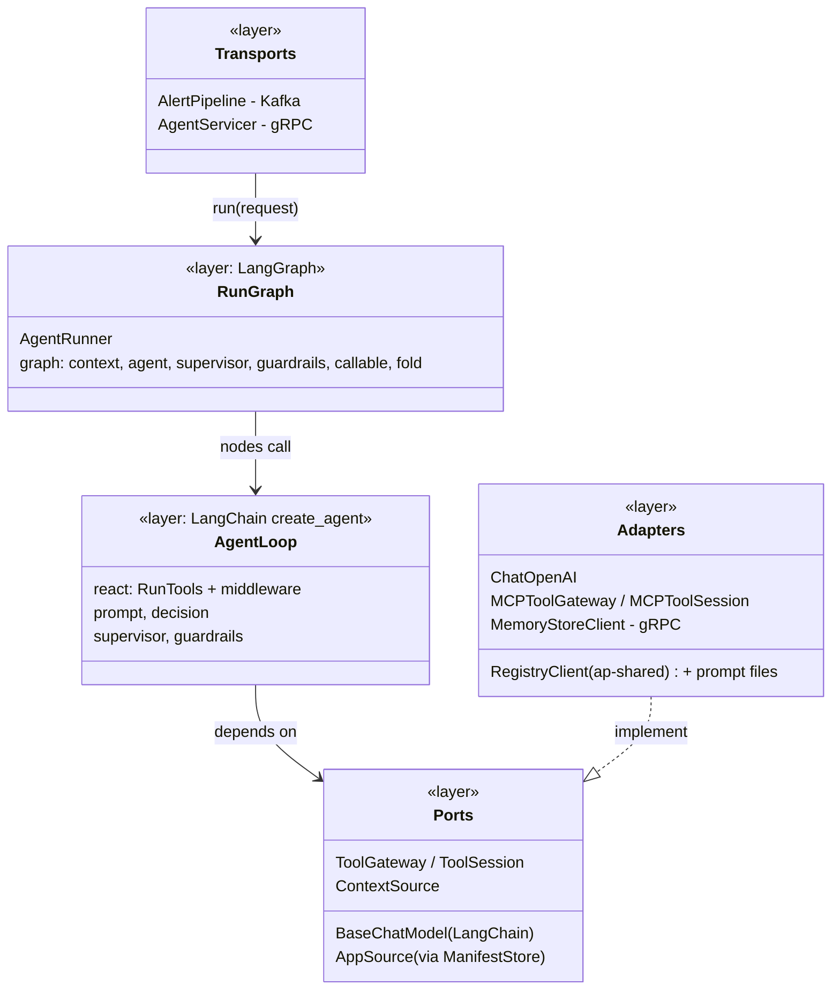
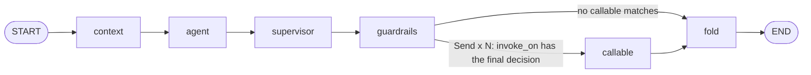

# orchestrator — class diagram

As built through Day 9 of `docs/plan.md` (Day 9: ADR-0023's `alert` echo and
every agent's tool calls in the response). `orchestrator` runs the agents.
It takes a `RunAgentRequest` (from Kafka `alert.received`, or the gRPC
`RunAgent` call) and resolves the app's manifest from `registry` and the
prompts from its image. Each run is a **LangGraph** graph (ADR-0022):
1. fetch the alert_key's history from `memory-store` over gRPC;
2. run the entry agent's tool loop (LangChain's prebuilt `create_agent`
   with `ChatOpenAI`) against `tool-gateway` over MCP;
3. apply the supervisor and the `escalate_when` guardrails;
4. fan out to the callable agents whose `invoke_on` matches the final
   decision, in parallel, and fold their reasons and tool calls in.

It returns one `RunAgentResponse` with a decision, a confidence,
`reasons[]`, every agent's tool calls (entry first, then callables, each
tagged with its `agent_id`), and the request echoed as `alert` (ADR-0023).

Python modules that are plain functions (no class) are drawn as
`<<module>>` boxes. Third-party and cross-service types are in the
`external` group.

## Overview: layers

Both transports call the same `AgentRunner.run()`. The graph's nodes are
small functions over the run's state. Per-run dependencies (chat model, MCP
session, memory client) arrive as LangGraph runtime context (`RunDeps`), so
the graph is compiled once per process. The supervisor and guardrails are
pure functions. Adapters are chosen in `main.py`.

## Full class diagram

```mermaid
classDiagram
    direction LR

    namespace entrypoint {
        class main {
            <<module>>
            +SERVICE_NAME = "orchestrator"
            +build_runner(settings, registry, memory) AgentRunner
            -lifespan(app) AsyncIterator
            +healthz() HealthResponse
        }
        class Settings {
            <<frozen dataclass>>
            +apps_dir: Path
            +tool_gateway_url: str
            +registry_url: str
            +memory_store_target: str
            +memory_store_timeout_s: float
            +min_confidence: float
            +manifest_ttl_s: float
            +kafka_bootstrap_servers: str
            +kafka_enabled: bool
            +grpc_port: int
            +llm_provider: str
            +llm_model: str
            +max_tool_rounds: int
            +callable_timeout_s: float
            +from_env()$ Settings
        }
    }

    namespace transports {
        class AlertPipeline {
            -_runner: AgentRunner
            -_received_topic, _decided_topic, _group_id
            +start() None
            +stop() None
        }
        class kafka_alerts {
            <<module: app.kafka.alerts>>
            +handle_alert(raw, runner) tuple?
            +message_key(app_id, alert_key) bytes
        }
        class AgentServicer {
            <<grpc servicer>>
            +RunAgent(request, context) RunAgentResponse
        }
    }

    namespace run_graph {
        class AgentRunner {
            -_manifests: ManifestStore
            -_gateway: ToolGateway
            -_model: BaseChatModel
            -_memory: ContextSource
            -_max_tool_rounds: int
            -_min_confidence: float
            -_callable_timeout_s: float
            -_graph: CompiledStateGraph
            -_callable_graph: CompiledStateGraph
            +run(request) RunAgentResponse
        }
        class loop {
            <<module: app.agent.loop>>
            +not_evaluated_response(request, why) RunAgentResponse
        }
        class graph {
            <<module: app.agent.graph>>
            +build_graph() CompiledStateGraph
            +build_callable_graph() CompiledStateGraph
            +context_node(state, runtime)
            +agent_node(state, runtime)
            +supervisor_node(state, runtime)
            +guardrails_node(state)
            +route_callables(state) list~Send~ or fold
            +callable_node(task, runtime)
            +fold_node(state)
            +explain(deps, manifest, agent, request, ctx, entry)
            +explain_node(state, runtime)
        }
        class RunDeps {
            <<frozen dataclass: runtime context>>
            +model: BaseChatModel
            +memory: ContextSource
            +tools: ToolSession?
            +gateway: ToolGateway
            +prompts(manifest, agent) str
            +max_tool_rounds: int
            +default_min_confidence: float
            +callable_timeout_s: float
        }
        class RunState {
            <<TypedDict: graph state>>
            +request, manifest, agent, app_prompt, run_context
            +memory_context: GetContextResponse?
            +decision, confidence, reasons, tool_calls
            +input_tokens, output_tokens
            +platform_reasons: list, append reducer
            +callable_results: list, append reducer
            +delegated_reasons: list
            +delegated_tool_calls: list
        }
        class CallableTask {
            <<TypedDict: Send payload>>
            +index: int
            +agent: AgentSpec
            +request, manifest, memory_context
            +entry: decision and reasons
        }
        class CallableFailed {
            <<exception: RuntimeError>>
        }
    }

    namespace agent_loop {
        class react {
            <<module: app.agent.react>>
            +INFRA_TOOL_ERRORS
            +REASON_PREFIX = "orchestrator: "
            +run_agent(model, system, first_message, tools, max_tool_rounds) AgentOutcome
            +summarize(result) str
        }
        class RunTools {
            +tools: list~StructuredTool~
            +trace: list~ToolCall~
            +infra_failures: list~str~
            +call(name, arguments) str
            +refuse(name) str
            +record(name, result) str
            +middleware(max_tool_rounds) list
        }
        class AgentOutcome {
            <<dataclass>>
            +text: str?
            +ran_out: bool
            +input_tokens, output_tokens: int
            +messages: list
        }
        class llm {
            <<module: app.agent.llm>>
            +build_chat_model(provider, model) BaseChatModel
        }
        class ModelErrors {
            <<AgentMiddleware>>
            +awrap_model_call(request, handler)
        }
        class LLMError {
            <<exception>>
        }
        class prompt {
            <<module: app.agent.prompt>>
            +new_nonce() str
            +build_system_prompt(app_prompt, nonce, role) str
            +data_block(kind, content, nonce) str
            +alert_data(request) dict
            +context_data(context) dict
            +alert_message(request, context, nonce) str
            +explain_message(request, context, entry, nonce) str
            +tool_result_message(tool_name, result, nonce) str
        }
        class decision {
            <<module: app.agent.decision>>
            +parse_decision(text) ParsedDecision
            +parse_explanation(text) list~str~
        }
        class ParsedDecision {
            <<frozen dataclass>>
            +decision: Decision
            +confidence: float
            +reasons: list~str~
        }
        class DecisionParseError {
            <<exception: ValueError>>
        }
        class supervisor {
            <<module: app.agent.supervisor>>
            +caps(decision, context) list
            +supervise(decision, agent_confidence, context, min_confidence) Supervised
        }
        class Supervised {
            <<frozen dataclass>>
            +decision: Decision
            +confidence: float
            +reason: str?
        }
        class guardrails {
            <<module: app.agent.guardrails>>
            +ENVELOPE_FIELDS
            +evaluate(rules, request, context) list~Match~
            +lookup(field, request, payload, context)
            +equal(value, allowed) bool
        }
        class Rule {
            <<frozen dataclass>>
            +field: str
            +values: list
        }
        class Match {
            <<frozen dataclass>>
            +index: int
            +rule: Rule
            +value
            +describe() str
        }
    }

    namespace ports_adapters {
        class ToolGateway {
            <<Protocol>>
            +connect() AsyncContextManager~ToolSession~
        }
        class ToolSession {
            <<Protocol>>
            +call_tool(name, arguments, context) ToolResult
        }
        class MCPToolGateway {
            +connect() AsyncIterator~MCPToolSession~
        }
        class MCPToolSession {
            +list_tools() list~GatewayTool~
            +call_tool(name, arguments, context) ToolResult
        }
        class ToolResult {
            <<frozen dataclass>>
            +is_error: bool
            +content: dict
            +error_code: str?
        }
        class ContextSource {
            <<Protocol>>
            +get_context(app_id, alert_key) GetContextResponse
        }
        class MemoryStoreClient {
            -_channel: grpc.aio.Channel
            +get_context(app_id, alert_key) GetContextResponse
            +aclose() None
        }
        class ContextUnavailableError {
            <<exception: RuntimeError>>
        }
        class GatewayUnavailableError {
            <<exception: RuntimeError>>
        }
    }

    namespace manifest_port {
        class ManifestStore {
            -_registry: AppSource
            -_apps_dir: Path
            +get(app_id) AppManifest
            +prompt(manifest, agent) str
        }
        class AppSource {
            <<Protocol>>
            +get_app(app_id) dict
        }
        class AppManifest {
            <<pydantic, extra=ignore>>
            +app_id, display_name: str
            +agents: list~AgentSpec~
            +memory_namespace: str
            +escalate_when: list~EscalateRule~
            +supervisor: SupervisorSpec?
            +agent(agent_id) AgentSpec
            +callables_for(decision) list~AgentSpec~
            +guardrails() list~Rule~
            +min_confidence(default) float
        }
        class AgentSpec {
            <<pydantic, extra=ignore>>
            +agent_id, version, prompt_ref: str
            +role: entry or callable
            +tool_allowlist, invoke_on: list~str~
            +tools: list~AgentTool~
        }
        class AgentTool {
            <<pydantic, extra=ignore>>
            +tool_id, version, scope, description: str
            +input_schema: dict
        }
        class EscalateRule {
            <<pydantic>>
            +field: str
            +in_: list, alias in
            +rule() Rule
        }
        class SupervisorSpec {
            <<pydantic>>
            +min_confidence: float? 0-1
        }
        class ResolutionError {
            <<exception: LookupError>>
        }
        class ManifestUnavailableError {
            <<exception: RuntimeError>>
        }
    }

    namespace external {
        class StateGraph {
            <<langgraph>>
        }
        class create_agent {
            <<langchain.agents>>
        }
        class StructuredTool {
            <<langchain_core.tools>>
        }
        class BaseChatModel {
            <<langchain_core>>
        }
        class ChatOpenAI {
            <<langchain_openai>>
        }
        class RunAgentResponse {
            <<proto: agent.proto>>
            +decision, confidence, reasons, tool_calls, alert_key, alert
        }
        class GetContextResponse {
            <<proto: memory_store.proto>>
        }
        class RunContext {
            <<ap-shared run_context>>
            +to_meta() dict
        }
        class RegistryClient {
            <<ap-shared registry_client>>
            +get_app(app_id) dict
        }
    }

    %% composition root
    main ..> Settings
    main ..> AgentRunner : build_runner
    main ..> llm : build_chat_model
    main ..> MCPToolGateway
    main ..> ManifestStore
    main ..> MemoryStoreClient : one channel per process
    main ..> RegistryClient
    main *-- AlertPipeline : lifespan

    %% transports
    AlertPipeline ..> kafka_alerts : handle_alert
    kafka_alerts ..> AgentRunner : run
    kafka_alerts ..> loop : not_evaluated_response
    AgentServicer --> AgentRunner
    AgentServicer ..> loop : not_evaluated_response

    %% run graph
    AgentRunner --> ManifestStore
    AgentRunner --> ToolGateway : one session per run
    AgentRunner ..> graph : compiles both graphs once
    AgentRunner ..> RunDeps : per run
    AgentRunner ..> RunAgentResponse : builds from final RunState
    graph ..> StateGraph
    graph ..> RunState
    graph ..> CallableTask : Send per matching callable
    graph ..> CallableFailed
    graph ..> react : agent and callable nodes
    graph ..> supervisor : supervisor node
    graph ..> guardrails : guardrails node
    graph ..> decision : parse answers
    graph ..> prompt : messages
    graph ..> ContextSource : context node
    graph ..> AppManifest : callables_for, guardrails, min_confidence

    %% agent loop
    react ..> create_agent : per agent run
    react *-- RunTools
    react ..> AgentOutcome : returns
    react ..> ModelErrors : middleware
    RunTools *-- StructuredTool : one per resolved tool
    RunTools --> ToolSession
    RunTools ..> RunContext : in MCP _meta
    RunTools ..> prompt : result data blocks
    ModelErrors ..> LLMError : raises
    llm ..> ChatOpenAI
    ChatOpenAI --|> BaseChatModel
    decision ..> ParsedDecision
    decision ..> DecisionParseError
    supervisor ..> Supervised
    guardrails ..> Match
    guardrails ..> Rule

    %% ports
    MCPToolGateway ..|> ToolGateway
    MCPToolSession ..|> ToolSession
    ToolSession ..> ToolResult
    MCPToolGateway ..> GatewayUnavailableError
    MemoryStoreClient ..|> ContextSource
    MemoryStoreClient ..> ContextUnavailableError
    MemoryStoreClient ..> GetContextResponse

    %% manifest
    ManifestStore --> AppSource
    RegistryClient ..|> AppSource
    ManifestStore ..> AppManifest
    ManifestStore ..> ResolutionError
    ManifestStore ..> ManifestUnavailableError
    AppManifest *-- AgentSpec
    AppManifest *-- EscalateRule
    AppManifest *-- SupervisorSpec
    AgentSpec *-- AgentTool
    EscalateRule ..> Rule
```

## The run graphs — `app/agent/graph.py`

**`build_graph()`** is the entry run. `AgentRunner.run` uses it when
`agent_id` is empty or names the entry agent.

| Node | Does | Writes |
|---|---|---|
| `context` | `memory-store` `GetContext` once (span `memory.get_context`). A `ContextUnavailableError` isn't fatal. | `memory_context` (or `None`), a "memory context unavailable" platform reason |
| `agent` | Builds `RunTools` and runs `run_agent` with the entry rules. Then: ran out of rounds, or an unparseable answer → ESCALATE with confidence 0; an infrastructure tool failure → ESCALATE. | `decision`, `confidence`, `reasons`, `tool_calls`, token counts, platform reasons |
| `supervisor` | `supervise()` with the manifest threshold or `RunDeps.default_min_confidence` | `decision`, `confidence`, its reason if it escalated |
| `guardrails` | `guardrails.evaluate()`; every match is a reason; forces ESCALATE if it wasn't already | `decision`, platform reasons |
| `route_callables` (edge) | `AppManifest.callables_for(final decision)`; one `Send("callable", CallableTask)` each, or `"fold"` if none | — |
| `callable` | Runs `explain()` under `asyncio.wait_for(CALLABLE_TIMEOUT_S)`. Success → reasons prefixed `"<agent_id>: "` plus any tool-failure reasons. Any failure → one `orchestrator: callable '<id>' didn't contribute (<why>).` reason (timeout, LLM, parse, rounds, missing prompt; anything else is logged as "failed"). | `callable_results: [(index, reasons, tool_calls)]` (no calls on failure) |
| `fold` | Sorts results by manifest index and flattens them | `delegated_reasons`, `delegated_tool_calls` |

`platform_reasons` and `callable_results` use an append reducer, so each
node adds to them, and the `Send` branches can write concurrently.
`AgentRunner` builds the response with reasons in this order:
`reasons + platform_reasons + delegated_reasons`, and tool calls as
`tool_calls + delegated_tool_calls` (ADR-0023).

**`build_callable_graph()`**, `context → explain`, is the direct path when
`RunAgent` names a callable. `explain_node` runs the same `explain()` with
no `entry` block. It returns the reasons unprefixed, with `decision`
`DECISION_UNSPECIFIED` and confidence 0. A failure becomes one
`orchestrator: no explanation (<why>).` reason.

**`explain()`** runs one callable agent:
- loads its prompt through `RunDeps.prompts`;
- opens its own MCP session, with a `RunContext` whose `agent_id` is the
  callable's;
- uses the *callable* platform rules and `prompt.explain_message` (alert,
  memory context and, when delegated, the `triage_decision` block);
- parses the answer with `parse_explanation`.

It raises `CallableFailed` if the loop ran out of rounds.

**`RunDeps`** is the runtime context. `tools` is the entry agent's MCP
session; callables open their own from `gateway`.

## Classes and modules

### Entry point — `app/main.py`, `app/core/config.py`

`main` is the composition root. `build_runner()` wires an `AgentRunner`
from:
- a `ManifestStore` over the `RegistryClient`;
- `MCPToolGateway`;
- `llm.build_chat_model(LLM_PROVIDER, LLM_MODEL)`;
- the `MemoryStoreClient`;
- `MAX_TOOL_ROUNDS`, `MIN_CONFIDENCE`, `CALLABLE_TIMEOUT_S`.

`lifespan()` builds everything at startup, not at import, because the
OpenAI client needs `OPENAI_API_KEY` and tests import `main` without one.

**`Settings`**: frozen dataclass read from the environment:
- `TOOL_GATEWAY_URL`, `REGISTRY_URL`, `MANIFEST_TTL_S` (default 30);
- `MEMORY_STORE_TARGET` (Compose: `memory-store:50051`),
  `MEMORY_STORE_TIMEOUT_S` (default 1);
- `MIN_CONFIDENCE` (default 0.6), `MAX_TOOL_ROUNDS` (default 5),
  `CALLABLE_TIMEOUT_S` (default 30);
- `LLM_PROVIDER`, `LLM_MODEL`;
- `KAFKA_*`, `GRPC_PORT`, `APPS_DIR`.

### Transports — `app/kafka/alerts.py`, `app/grpc/server.py`

These are unchanged by LangGraph: both call `AgentRunner.run()`.
- `handle_alert()` turns any failed run (`ResolutionError`, `LLMError`,
  `ManifestUnavailableError`, `GatewayUnavailableError`, anything else) into
  `not_evaluated_response()`, so every decodable alert gets exactly one
  `alert.decided`.
- `AlertPipeline` commits only after publishing.
- `AgentServicer` returns `NOT_FOUND` for an unknown app or agent, and
  "not evaluated" for other failures.

### Agent loop — `app/agent/react.py`, `llm.py`

**`run_agent()`** builds `langchain.agents.create_agent(model, tools,
system_prompt, middleware)` per run (about 1 ms), because each agent has
its own tools bound to this run's session. It runs the agent with one
`HumanMessage` and a `recursion_limit` well above the round limit. It
returns an **`AgentOutcome`**:
- the last AI message's text;
- `ran_out` if that message still asked for tools;
- summed `usage_metadata` tokens.

**`RunTools`**: the agent's tools for one run.
- One `StructuredTool` per resolved `AgentTool` (`args_schema` = its JSON
  schema). The tool's coroutine calls `ToolSession.call_tool` with the
  `RunContext` in `_meta` (never as an argument, §13 T4), inside an
  `agent.tool_call` span.
- `record()` adds the call to `trace` (`ToolCall` with a 300-char summary
  and the run context's `agent_id`),
  collects `INFRA_TOOL_ERRORS` into `infra_failures`, and returns the result
  wrapped in a nonce data block. That data block is what the model sees
  (§13 T1/T2).
- `middleware()` returns two hooks:
  - `only_offered_tools` (`wrap_tool_call`): a tool name the agent wasn't
    given is answered with `refuse()` (`tool_not_allowed`), never reaching
    `tool-gateway`;
  - `tool_round_limit` (`after_model`, can jump to end): once
    `max_tool_rounds` model calls have asked for tools, the next request
    for tools ends the loop.

**`llm`**:
- `build_chat_model()` returns `ChatOpenAI(model, timeout=60,
  max_retries=2)` for `openai`. Swapping providers is a change here
  (ADR-0022).
- **`ModelErrors`** middleware turns any exception from the model call into
  **`LLMError`**, the one error type callers handle.

### Prompt and answers — `prompt.py`, `decision.py`

**`prompt`**:
- `build_system_prompt(app_prompt, nonce, role)` has two variants, each
  with the same rules for data blocks, memory (§13 T3) and tools:
  - `entry`: decide; answer with `decision`/`confidence`/`reasons`;
  - `callable`: explain, don't decide; answer with `reasons` only.
- `alert_data()` includes `fired_at`, an ISO 8601 UTC string, next to
  `timestamp_unix_ms`, so the agent never converts epochs.
- `alert_message()` builds the entry agent's alert and `memory_context`
  blocks. `explain_message()` adds a `triage_decision` block (the final
  decision and its reasons) when the callable runs by delegation.

**`decision`**:
- `parse_decision()`: strict JSON (an optional code fence is allowed).
  `decision` must be one of the three values, `confidence` a number from 0
  to 1 (not a string or boolean), and `reasons` non-empty.
- `parse_explanation()`: `{"reasons": [...]}`, extra keys ignored.

Both cap the reasons at 10 of 500 characters each, and raise
`DecisionParseError` rather than guess.

### Supervisor and guardrails — `supervisor.py`, `guardrails.py`

Unchanged from Day 7 (ADR-0020, ADR-0010), now called from graph
nodes.
- **Supervisor**: confidence = min(agent's value, caps); the caps are no
  context 0.5, a novel key that isn't ESCALATE 0.5, and SUPPRESS with an
  analyst-confirmed incident 0.3. Below the threshold, the decision becomes
  ESCALATE.
- **Guardrails**: `alert.*` / `payload.*` / `context.*` rules, matched
  type-strictly; a missing or non-scalar field never matches.

### Ports — `app/tools/gateway.py`, `app/memory/client.py`

- **`ToolGateway` / `ToolSession`**: `connect()` opens an `mcp.Client`;
  if that fails (tool-gateway down: MCP initialize fails before any call)
  it raises `GatewayUnavailableError`, and the run is "not evaluated".
  `MCPToolSession.call_tool` sends the arguments, with `RunContext` as
  `_meta`. A transport failure on a call becomes `gateway_unreachable`.
- **`MemoryStoreClient`**: one `grpc.aio` channel per process, with a
  deadline on each call. Any RPC error becomes `ContextUnavailableError`.

### Manifest — `app/core/manifest.py`

**`ManifestStore`** resolves an app through `RegistryClient` (30s TTL).
`prompt()` reads an agent's `prompt_ref` from the app folder in the image.

**`AppManifest`** methods:
- `agent(agent_id)`: an empty id means the entry agent;
- `callables_for(decision)`: callables whose `invoke_on` lists that
  decision, in manifest order;
- `guardrails()`;
- `min_confidence(default)`.

## Run flow (one alert)

1. A transport hands `AgentRunner.run` a `RunAgentRequest`.
2. `ManifestStore.get` → `AppManifest.agent` → `ManifestStore.prompt`.
3. One MCP session opens; `RunDeps` is built; the graph is chosen by the
   agent's role.
4. `context`: `MemoryStoreClient.get_context`.
5. `agent`: `run_agent` loops `ChatOpenAI` ⇄ `RunTools`, then
   `parse_decision`.
6. `supervisor`, then `guardrails`.
7. `route_callables` → `callable` branches run concurrently, each with its
   own `create_agent`, tools and MCP session → `fold`.
8. `AgentRunner` builds the one `RunAgentResponse`. The transport
   publishes it to `alert.decided` (keyed `{app_id}:{alert_key}`) or
   returns it over gRPC.

## Design notes

- **Framework outside, rules inside** (ADR-0022): LangGraph owns the order
  of steps and LangChain owns the tool loop. The platform's guarantees
  live in our code:
  - the run context goes in `_meta`;
  - every tool result goes into a data block;
  - only offered tools reach `tool-gateway`;
  - the supervisor and guardrails are deterministic;
  - every failure leads to ESCALATE.

  `langchain-mcp-adapters` and LangChain structured output are
  deliberately not used.
- **Only toward ESCALATE after the LLM**: the supervisor and guardrails can
  only raise a decision; callables never change it.
- **Callables are bounded**: chosen by the manifest, never by the LLM;
  parallel; one level deep; a per-callable timeout; a failure only adds a
  reason. Exactly one response, and so one `alert.decided`, per alert.
- **Testability**: tests use a scripted LangChain `FakeChatModel`:
  - per-agent scripts and delays, chosen by prompt text;
  - tools bound per agent;
  - every call recorded.

  Fakes stand in for the gateway, registry and memory, and no test calls a
  real LLM.
- **Next changes**: Day 13 adds `similar-past-case-lookup` to the triage
  agent; Day 14 adds budgets, where an over-budget callable doesn't
  contribute.
