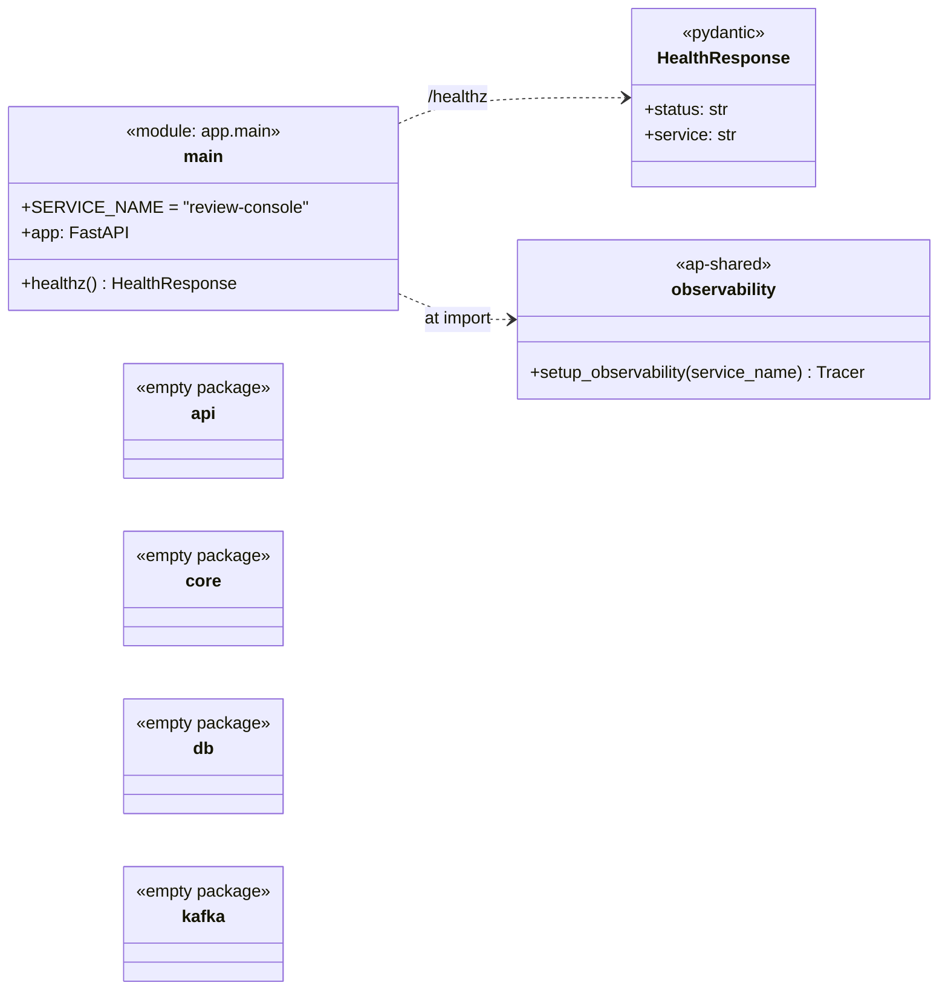
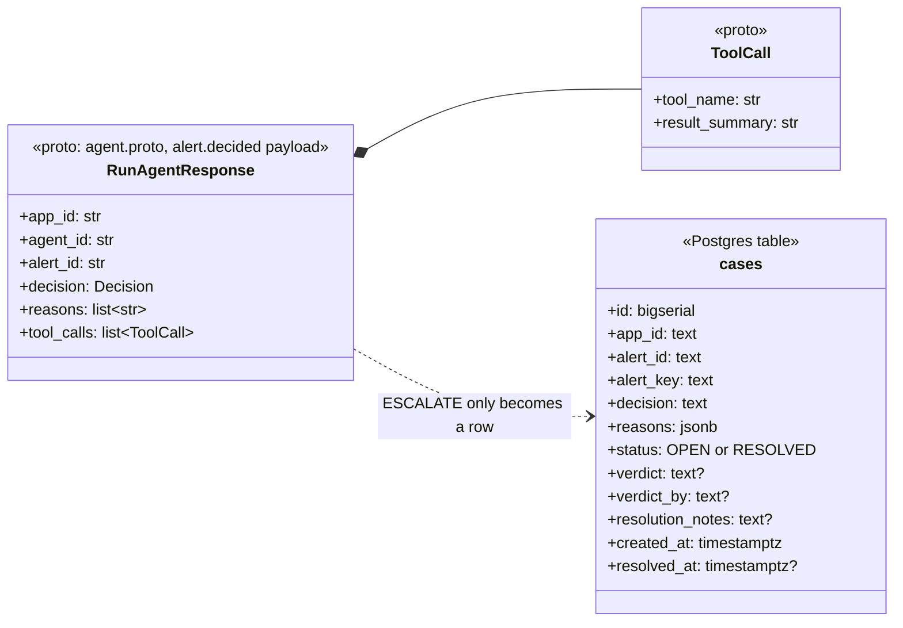

# review-console — class diagram

**Status: skeleton only.** Through Day 6 of `docs/plan.md`,
`review-console` has a FastAPI app with `/healthz` and nothing else. The
`api/`, `core/`, `db/` and `kafka/` packages are empty `__init__.py`
stubs. It is built on Day 9.

## As built today

- **`main`**: creates the FastAPI app at import time, calls
  `setup_observability("review-console")`, and serves `GET /healthz`.
- **`HealthResponse`**: the `{status, service}` body that Compose health
  checks poll.

## Contracts already in the repo (implementation pending)

The `cases` table already exists in `backend/local/postgres/init.sql`.
The message it will consume, `RunAgentResponse`, is in
`backend/proto/agent.proto`.

- **`cases`**: one row per escalated alert. `UNIQUE (app_id, alert_id)`
  means a duplicate `alert.decided` can never create a second case.
  - Indexes on `(app_id, alert_key)` and `(app_id, status)` back the
    planned `GET /cases` filters.
  - `resolution_notes` holds the analyst's account of the actual fix. It
    stays on the case and never goes into Kafka.

### Planned design (from `docs/plan.md` Day 9)

- A Kafka consumer on `alert.decided` that persists only `ESCALATE`
  decisions into `cases`.
- REST endpoints:
  - `GET /cases`, filterable by `app_id`, `alert_key`, ...;
  - `GET /cases/{id}`, showing `reasons[]` and the tool-call summary;
  - `POST /cases/{id}/verdict`, with `verdict`, `verdict_by` and optional
    `resolution_notes`.
- A verdict state machine: a case moves `OPEN` → `RESOLVED` exactly once.
  A second verdict is rejected.
- A producer of `verdict.recorded`, keyed `{app_id}:{alert_key}`.
  `memory-store` consumes it on Day 10.
- Replaces `ingestion`'s Day 4 debug `GET /alerts/{id}`.

Update this file with the real classes when Day 9 lands.
