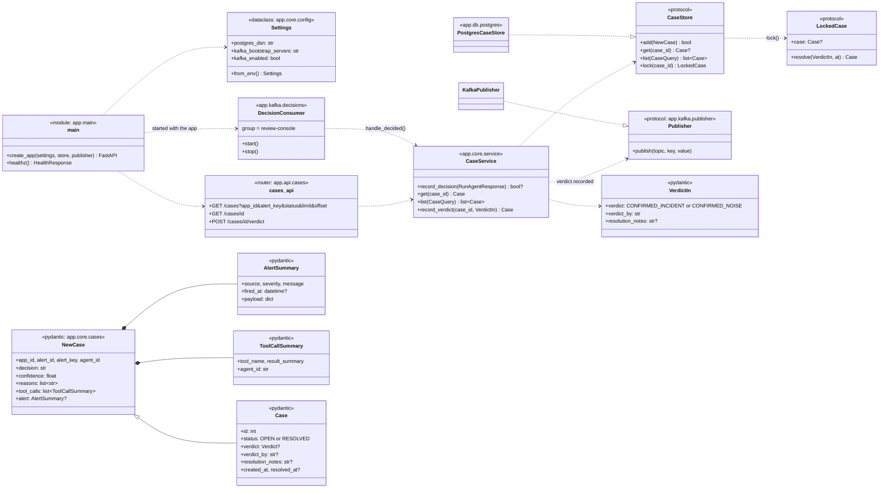

# review-console — class diagram

As built through Day 11 of `docs/plan.md` (unchanged since Day 9): an `alert.decided` consumer that
turns escalations into cases, the analyst REST API, and the
`verdict.recorded` producer.

- **`case_from_decision()`** (`app.core.cases`) is the persistence filter:
  only `ESCALATE` becomes a `NewCase`; `AUTO_RESOLVE`/`SUPPRESS` return
  `None`. It copies `RunAgentResponse.alert` into `AlertSummary` (`None`
  for a decision published before ADR-0023) and each `ToolCall`'s
  `agent_id`. `PostgresCaseStore.add` is `ON CONFLICT (app_id, alert_id) DO
  NOTHING`, so a redelivered decision never creates a second case.
- **`CaseService.record_verdict`** holds the state machine, under
  `lock()` (`SELECT ... FOR UPDATE`): no case → `CaseNotFoundError` (404),
  `RESOLVED` → `CaseAlreadyResolvedError` (409), else `resolve()` and
  publish `verdict.recorded` before commit. A `PublishError` rolls back
  (503; the case stays `OPEN`). A 503 from the send *timeout* may still be
  delivered once Kafka is back (Day 11; open decision in `plan.md` Day 15).
- **`verdict_event()`** builds the `verdict.recorded` body: `{app_id,
  case_id, alert_key, verdict, verdict_by, recorded_at}`, keyed
  `{app_id}:{alert_key}`. `resolution_notes` stays on the case (ADR-0011).
- **`DecisionConsumer`**: own group, one message at a time, commit after
  handling; unusable messages are skipped, Postgres errors retried.
- With `KAFKA_ENABLED=false`, `main` uses a publisher that always raises
  `PublishError`: cases are readable, verdicts get 503.
