# tool-gateway — class diagram

As built through Day 9 of `docs/plan.md` (unchanged since Day 8). `tool-gateway` is the platform's
MCP server. At startup it imports every app's tool modules from
`backend/apps/*/tools/` into a `ToolRegistry`. It then serves MCP
`tools/list` and `tools/call` over stateless Streamable HTTP at
`POST /mcp`. Every call is checked against the calling agent's tools as
`registry` resolves them before it runs. Every tool is a read-only lookup
(ADR-0004).

Naming: `ToolRegistry` is this service's in-memory table of *loaded* tool
code. The `registry` *service* (and `ap-shared`'s `RegistryClient`) is
where apps, agents and tool permissions live.

Python modules that are plain functions (no class) are drawn as
`<<module>>` boxes. Third-party, cross-service and app-owned types are in
the `external` and `app_tools` groups.

```mermaid
classDiagram
    direction LR

    namespace entrypoint {
        class main {
            <<module>>
            +SERVICE_NAME = "tool-gateway"
            +MCP_PATH = "/mcp"
            +DEFAULT_APPS_DIR: Path
            +DEFAULT_ALLOWED_HOSTS: str
            +DEFAULT_REGISTRY_URL: str
            +create_app(apps_dir, allowed_hosts, apps) FastAPI
            -lifespan(app) AsyncIterator
            +healthz() HealthResponse
        }
        class HealthResponse {
            <<pydantic>>
            +status: str
            +service: str
        }
    }

    namespace core {
        class ToolRegistry {
            -_tools: dict~str, ToolSpec~
            +add(tool: ToolSpec) None
            +get(tool_id) ToolSpec
            +list() list~ToolSpec~
            +__len__() int
        }
        class ToolSpec {
            <<frozen dataclass>>
            +tool_id: str
            +version: str
            +description: str
            +scope: str
            +app_id: str?
            +input_model: type~BaseModel~
            +output_model: type~BaseModel~
            +handler: Callable
            +read_only: bool
            +input_schema() dict
            +output_schema() dict
            +invoke(arguments) BaseModel
        }
        class ToolNotFoundError {
            <<exception: LookupError>>
            +tool_id: str
        }
        class DuplicateToolError {
            <<exception: ValueError>>
        }
        class loader {
            <<module: app.core.loader>>
            +load_app_tools(apps_dir, registry) None
            -_import_by_path(app_id, module_path) ModuleType
            -_tool_specs(app_id, module_path, module) list~ToolSpec~
            -_tool_spec(app_id, module_path, tool_id, definition) ToolSpec
        }
        class ToolLoadError {
            <<exception: RuntimeError>>
        }
    }

    namespace mcp_layer {
        class mcp_server {
            <<module: app.mcp.server>>
            +SERVER_NAME = "tool-gateway"
            +build_mcp_server(registry, apps) Server
            +call_tool(registry, apps, name, arguments, context) CallToolResult
            -_allowed_tools(apps, context) set~str~
            -_to_mcp_tool(tool) Tool
            -_error(code, message, extra) CallToolResult
        }
        class on_list_tools {
            <<closure handler>>
            tools/list
        }
        class on_call_tool {
            <<closure handler>>
            tools/call
        }
        class AppSource {
            <<Protocol>>
            +get_app(app_id) dict
        }
    }

    namespace external {
        class Server {
            <<mcp SDK>>
        }
        class StreamableHTTPSessionManager {
            <<mcp SDK, stateless + json_response>>
            +run() AsyncContextManager
        }
        class StreamableHTTPASGIApp {
            <<mcp SDK ASGI app>>
        }
        class TransportSecuritySettings {
            <<mcp SDK>>
            +enable_dns_rebinding_protection
            +allowed_hosts
        }
        class RunContext {
            <<ap-shared run_context>>
            +app_id: str
            +agent_id: str
            +alert_id: str
        }
        class run_context {
            <<ap-shared module>>
            +from_meta(meta) RunContext?
        }
        class CallToolResult {
            <<mcp_types>>
            +content: list~TextContent~
            +structured_content: dict
            +is_error: bool
        }
        class Tool {
            <<mcp_types>>
            +name, description
            +input_schema, output_schema
            +annotations: read_only_hint
            +meta: version, scope, app_id, read_only
        }
        class RegistryClient {
            <<ap-shared registry_client>>
            +get_app(app_id) dict
            +aclose() None
        }
        class AppNotFoundError {
            <<ap-shared registry_client>>
        }
        class RegistryUnavailableError {
            <<ap-shared registry_client>>
        }
    }

    namespace app_tools {
        class AppToolModule {
            <<contract: backend/apps/app_id/tools/*.py>>
            +TOOLS: dict~tool_id, definition~
        }
        class lookup_runbook {
            <<module: it-ops-triage/tools/lookup_runbook.py>>
            +RUNBOOKS: dict~str, RunbookEntry~
            +lookup_runbook(args) LookupRunbookOutput
            -_load_runbooks(path) dict
        }
        class LookupRunbookInput {
            <<pydantic, extra=forbid>>
            +alert_type: str
        }
        class recent_changes_lookup {
            <<module: it-ops-triage/tools/recent_changes_lookup.py>>
            +CHANGES: list~Change~
            +recent_changes_lookup(args) RecentChangesOutput
            -_load_changes(path) list
        }
        class RecentChangesInput {
            <<pydantic, extra=forbid>>
            +service_or_host: str
            +window_start, window_end: AwareDatetime
        }
        class RecentChangesOutput {
            <<pydantic, extra=forbid>>
            +service_or_host: str
            +window_start, window_end
            +found: bool
            +changes: list~Change~
            +message: str?
        }
        class Change {
            <<pydantic, extra=forbid>>
            +ref, service, author, summary: str
            +timestamp: AwareDatetime
            +type: deploy or config or infra
            +hosts: list~str~
        }
        class LookupRunbookOutput {
            <<pydantic>>
            +found: bool
            +alert_type: str
            +runbook: RunbookEntry?
            +message: str?
        }
        class RunbookEntry {
            <<pydantic>>
            +runbook_id: str
            +alert_type: str
            +title: str
            +description: str
            +likely_causes: list~str~
            +diagnostic_checks: list~str~
            +suggested_action: str
            +action_conditions: str
            +owner_team: str
            +severity_hint: str
        }
    }

    %% composition root
    main *-- ToolRegistry : app.state.registry
    main ..> loader : load_app_tools at startup
    main ..> mcp_server : build_mcp_server
    main *-- StreamableHTTPSessionManager : lifespan runs it
    main *-- StreamableHTTPASGIApp : Route POST /mcp
    main ..> TransportSecuritySettings : DNS-rebinding guard
    main ..> HealthResponse
    main *-- RegistryClient : unless apps injected, closed in lifespan
    StreamableHTTPSessionManager o-- Server
    StreamableHTTPASGIApp --> StreamableHTTPSessionManager

    %% registry
    ToolRegistry o-- ToolSpec : keyed by tool_id
    ToolRegistry ..> ToolNotFoundError : get raises
    ToolRegistry ..> DuplicateToolError : add raises

    %% loader
    loader ..> AppToolModule : imports by file path
    loader ..> ToolSpec : builds, scope=app
    loader ..> ToolRegistry : add
    loader ..> ToolLoadError : any problem fails startup

    %% MCP
    mcp_server ..> Server : creates
    Server --> on_list_tools
    Server --> on_call_tool
    on_list_tools ..> ToolRegistry : list
    on_list_tools ..> Tool : via _to_mcp_tool
    on_call_tool ..> run_context : from_meta
    on_call_tool ..> mcp_server : call_tool
    mcp_server --> AppSource : allowlist re-check
    RegistryClient ..|> AppSource
    mcp_server ..> AppNotFoundError : catches -> tool_not_allowed
    mcp_server ..> RegistryUnavailableError : catches -> registry_unavailable
    mcp_server ..> ToolRegistry : get
    mcp_server ..> ToolSpec : invoke
    mcp_server ..> CallToolResult : success or is_error
    run_context ..> RunContext

    %% app tools
    lookup_runbook ..|> AppToolModule : exports TOOLS
    lookup_runbook ..> LookupRunbookInput
    lookup_runbook ..> LookupRunbookOutput
    recent_changes_lookup ..|> AppToolModule : exports TOOLS
    recent_changes_lookup ..> RecentChangesInput
    recent_changes_lookup ..> RecentChangesOutput
    RecentChangesOutput *-- Change
    LookupRunbookOutput *-- RunbookEntry
    ToolSpec ..> LookupRunbookInput : input_model
    ToolSpec ..> LookupRunbookOutput : output_model
```

## Classes and modules

### Entry point — `app/main.py`

**`main` (module)** is the composition root. `create_app(apps_dir,
allowed_hosts, apps)` does the setup:
1. Builds an empty **`ToolRegistry`** and fills it with
   **`load_app_tools()`**. Any bad tool module fails startup here.
2. Uses `apps` as the source of agents' allowlists: a fake in tests,
   otherwise a **`RegistryClient`** on `REGISTRY_URL` (default
   `http://localhost:8005`) with `MANIFEST_TTL_S` (default 30, the same
   as `orchestrator` and `ingestion`).
3. Wraps both in an MCP **`Server`** (`build_mcp_server`).
4. Hosts that server in a **`StreamableHTTPSessionManager`** with
   `stateless=True` and `json_response=True`. Every call is one
   request/response, so any replica can serve any call and rolling
   updates need no sticky sessions.
5. Enables DNS-rebinding protection through **`TransportSecuritySettings`**,
   which checks the `Host` header against `MCP_ALLOWED_HOSTS` (default
   `localhost:*`, `127.0.0.1:*`, `tool-gateway:*`).
6. Mounts the session manager at `/mcp` as a plain `Route`, not a
   `Mount`. A `Mount` would 307-redirect `/mcp` to `/mcp/`.

`lifespan()` runs the session manager's task group and closes the
`RegistryClient` on shutdown if `create_app()` made one. **`HealthResponse`** is
the `/healthz` body. The registry is also kept on `app.state.registry` for
tests.

### Core — `app/core/registry.py`

**`ToolSpec`**: one loaded tool, the gateway's internal tool model.
- **Identity**: `tool_id`, `version`, `description`, `scope` (`app` or
  `global`), and `app_id` (the owner for `app` scope, `None` for global).
- **Behaviour**: `input_model` and `output_model` (pydantic classes) plus
  `handler`.
- **`read_only`**: as declared by the tool's author; the loader only
  accepts `True`. It's advertised over MCP so `register_app.py` can
  register it in `registry`, which also rejects anything else.

Methods:
- `input_schema()` and `output_schema()` produce the JSON Schemas
  advertised over MCP.
- `invoke(arguments)` validates the arguments with `input_model` (raising
  pydantic `ValidationError`) and runs the handler, sync or async. It
  checks the result is an instance of `output_model` and raises
  `TypeError` if not. A tool cannot return an undeclared shape.

**`ToolRegistry`**: the in-memory `tool_id → ToolSpec` table, built once at
startup (hot reload was rejected in ADR-0014).
- `add()` rejects a duplicate `tool_id` across all apps with
  `DuplicateToolError`, because MCP tool names are global.
- `get()` raises `ToolNotFoundError`.
- `list()` is sorted by `tool_id`, so `tools/list` is deterministic.

Being in the `ToolRegistry` doesn't mean a caller may use a tool. Per-agent
access is checked on every call against the `registry` service (see
`call_tool` below).

**`ToolNotFoundError`** carries the `tool_id` and becomes the
`tool_not_found` error code. **`DuplicateToolError`** is turned into a
`ToolLoadError` by the loader.

### Core — `app/core/loader.py`

**`loader` (module)**: discovers app tools on disk.
- **`load_app_tools(apps_dir, registry)`**: for each `apps_dir/{app_id}/tools/`,
  imports every `*.py` whose name doesn't start with `_`, in sorted order,
  and registers its tools.
- **`_import_by_path()`**: app folders are hyphenated (`it-ops-triage`), so
  they can't be Python packages. Each module is imported by file path
  under a synthetic `_apptools.{app}.{module}` name. The module is put in
  `sys.modules` before running it so pydantic can resolve forward refs,
  and removed again if the import fails.
- **`_tool_specs()` / `_tool_spec()`**: check the module's `TOOLS` dict
  strictly:
  - each `tool_id` matches `[a-z][a-z0-9_-]{0,63}`;
  - the keys are exactly `version`, `description`, `input_model`,
    `output_model`, `handler` and `read_only`;
  - `read_only` is `True` (ADR-0004, ARCHITECTURE §13 T8);
  - both models are `BaseModel` subclasses;
  - `handler` is callable;
  - `version` and `description` are non-empty strings.

  Every tool loaded this way gets `scope="app"` and the folder's `app_id`.

**`ToolLoadError`**: any loader problem, naming the file. Startup fails
loudly instead of leaving a tool missing until a live run gets
`tool_not_found`.

### MCP layer — `app/mcp/server.py`

**`build_mcp_server(registry, apps)`** creates the MCP SDK `Server` with two
closure handlers:
- **`on_list_tools`**: converts every `ToolSpec` with `_to_mcp_tool`. Not
  filtered by caller: `register_app.py` registers tools from this listing.
- **`on_call_tool`**: reads the `RunContext` from the request's `_meta`
  using `run_context.from_meta`, then calls `call_tool`.

**`call_tool(registry, apps, name, arguments, context)`** does the
dispatch, kept separate from the closures so tests can call it directly.
- **No run context → refused.** A call must carry `app_id`/`agent_id` in
  `_meta` (`mcp_call.py` sends them via `--app-id`/`--agent-id`).
- **Allowlist re-check** (defense in depth, plan Day 5): `_allowed_tools`
  gets the app from `apps` (cached 30s) and takes the calling agent's
  `tools`, which `registry` has already resolved as allowlisted, declared
  and enabled. An unknown app or agent means an empty set. This happens
  *before* the tool is looked up, so a refused caller can't probe which
  tools exist.
- **Ownership check**: an `app`-scoped tool called for another `app_id` is
  refused even if listed.
- It logs every call with `app_id`/`agent_id`/`alert_id`.
- Every failure is returned as a tool result, never a protocol error:

  | Code | When |
  |---|---|
  | `tool_not_allowed` | no run context; the tool isn't in the agent's resolved tools (not allowlisted, disabled, unknown app/agent); or it's another app's tool |
  | `registry_unavailable` | `registry` unreachable and nothing cached: the call is refused (fails closed). `orchestrator` treats it as an infra failure and escalates |
  | `tool_not_found` | no such tool is loaded |
  | `invalid_arguments` | pydantic validation failed; the result includes the error details without echoing the input |
  | `tool_failed` | the handler raised, or returned the wrong type; the exception is logged, not returned |

- On success it returns both `structured_content` (the output model as
  JSON) and the same JSON as text.

**`_to_mcp_tool(tool)`**: `ToolSpec` → MCP `Tool`.
- It carries the input and output schemas.
- It sets `read_only_hint=True` and `destructive_hint=False`, so any MCP
  client can see the tool is safe.
- It puts `version`, `scope`, `app_id` and `read_only` in `meta`.
  `register_app.py` reads them to register the tool in `registry`.

**`_error(code, message, **extra)`** builds the uniform
`{error, message, ...}` error result with `is_error=True`.

### External types

- **`Server`, `StreamableHTTPSessionManager`, `StreamableHTTPASGIApp`,
  `TransportSecuritySettings`, `Tool`, `CallToolResult`**: the MCP Python
  SDK.
- **`RunContext` / `from_meta`** (`ap-shared` `run_context`): reads the
  `agentic-platform/app_id|agent_id|alert_id` keys from `_meta`. It returns
  `None` unless `app_id` and `agent_id` are both non-empty strings.
- **`RegistryClient`**, **`AppNotFoundError`**, **`RegistryUnavailableError`**
  (`ap-shared` `registry_client`): the shared `registry` reader with its
  30s TTL cache; it serves an expired copy while `registry` is down.

### App-owned tools — the plug-in contract

These live in `backend/apps/{app_id}/tools/`, not in this service, and
never import `tool-gateway` code. The only contract is the shape of the
`TOOLS` dict (**`AppToolModule`** in the diagram).

Two tools so far, both `it-ops-triage`'s.

**`lookup_runbook`** (Day 2), used by both of its agents:
- **`LookupRunbookInput`**: `alert_type`, slug pattern, `extra="forbid"`.
- **`LookupRunbookOutput`**: `found` plus an optional `RunbookEntry` or
  `message`.
- **`RunbookEntry`**: one runbook, including an advisory
  `suggested_action` and the `runbook_id` the agent cites in its reasons.
- **`RUNBOOKS`**: loaded from `runbooks.json` at import, rejecting
  duplicate `alert_type`s.

**`recent-changes-lookup`** (Day 8), allowlisted only for
`root-cause-summarizer`:
- **`RecentChangesInput`**: `service_or_host` and a window. Both ends must
  be timezone-aware ISO 8601, the end no earlier than the start, and the
  window at most 7 days; `extra="forbid"`.
- **`RecentChangesOutput`**: the query echoed back, `found`, the matching
  **`Change`**s (most recent first), or a "no recorded changes" `message`.
- A change matches when the target is its `service` or one of its `hosts`
  (exact match), and its `timestamp` is inside `[window_start,
  window_end]`, both ends included.
- **`CHANGES`**: loaded from `recent_changes.json` at import, rejecting
  duplicate `ref`s. Timestamps are absolute, like a real change log. The
  shape is meant to survive swapping in GitHub, ArgoCD or a CMDB.

Both are fixture-backed and change only through git (ADR-0009).

## Request flow (`tools/call`)

1. `POST /mcp` reaches `StreamableHTTPASGIApp`, then the
   `StreamableHTTPSessionManager` (stateless), then `Server`, then
   `on_call_tool`.
2. `from_meta(params.meta)` gives the `RunContext` (missing:
   `tool_not_allowed`).
3. `_allowed_tools` gets the agent's resolved tools from
   `RegistryClient.get_app` (cached; `registry` down with no copy:
   `registry_unavailable`). `name` not among them: `tool_not_allowed`.
4. `call_tool` calls `ToolRegistry.get(name)` (on failure:
   `tool_not_found`), then refuses another app's `app`-scoped tool
   (`tool_not_allowed`).
5. `ToolSpec.invoke(arguments)` validates with `input_model` (on failure:
   `invalid_arguments`), runs `handler` (on exception: `tool_failed`) and
   checks the result is `output_model` (on mismatch: `tool_failed`).
6. The result is `CallToolResult` with `structured_content` and text.

## Design notes

- **Plug-in by convention, not by import**: adding an app's tool means
  dropping a module with `TOOLS` into its folder. The service code doesn't
  change; the image is rebuilt (ADR-0014).
- **Strict at startup, forgiving at runtime**: load errors crash the
  process, while call errors are structured results the agent can reason
  about.
- **Stateless transport**: chosen for horizontal scaling and safe rolling
  updates.
- **`app/grpc/` is an empty package**: nothing is served over gRPC yet.
- **Fail closed on permissions**: if the allowlist can't be checked, the
  call is refused, never served unchecked.
- **Next changes**:
  - Day 12: timeouts and sandboxing around `ToolSpec.invoke`.
  - Day 13: global tools (`scope="global"`) that receive `app_id` from the
    context.
