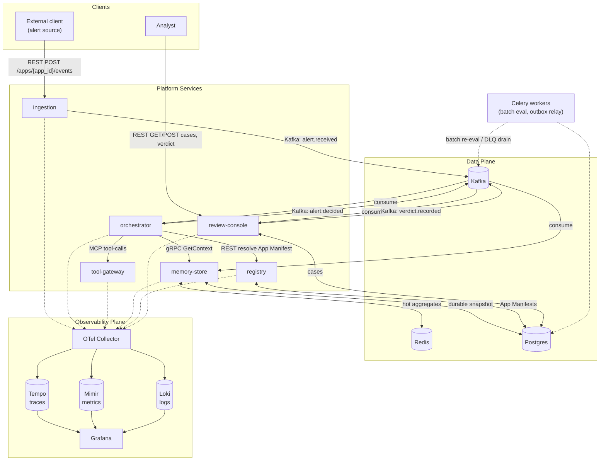

# Platform Block Diagram

A component-level view of the platform. For the day-by-day build sequence
see `docs/plan.md`; for the full design rationale, contracts, and the
multi-app model see `docs/ARCHITECTURE.md` (this doc is the picture,
`ARCHITECTURE.md` is the detail behind each block).

**Reading the diagram**: solid arrows are synchronous calls or event
publishes on the hot path; dashed arrows are telemetry (traces/logs/metrics)
or off-path async work (Celery).

---

## Clients

### External client (alert source)
Whatever produces alerts in the domain app — a monitoring system, another
service, or a curl/test script during development. Talks only to
`ingestion`, over REST. Never talks to Kafka, `orchestrator`, or any other
internal service directly.

### Analyst
A human reviewing escalated cases through `review-console`'s REST API.
Only sees `ESCALATED` decisions — auto-resolved/suppressed alerts never
reach a person (see `review-console` below).

---

## Platform services

### `ingestion`
The only REST entrypoint for new events. Validates a request against the
target app's `event_schema_ref` (from `registry`'s App Manifest), publishes
`alert.received` to Kafka, and returns `202` immediately — it does not wait
for a decision. Owns reliability at the edge: an outbox + DLQ (Day 14 of
`docs/plan.md`) so a Kafka outage doesn't silently drop alerts, and
per-source rate limiting (Day 13).

### `orchestrator`
The agent runtime — the only service that runs LLM tool-calling loops. On
consuming `alert.received`, it resolves the event's `app_id` against
`registry` to get that app's agent config and tool allowlist, calls
`memory-store` for behavioral context, runs the tool-calling loop against
`tool-gateway`, applies a confidence/supervisor check, and publishes
`alert.decided` with `reasons[]` populated from its own tool-call trace.
Also exposes `RunAgent` as a direct gRPC call (same contract, synchronous
path) for testing without going through Kafka — and reuses that same call
internally for agent delegation: `it-ops-triage`'s `triage-agent` (entry)
calls its sibling `root-cause-summarizer` (callable-only) this way on
`ESCALATE`, folding the reply's `reasons[]` into its own before publishing
`alert.decided` (`docs/ARCHITECTURE.md` §3/§5). One direction only, scoped
to one app's own manifest — not cross-app A2A. Owns cost/budget enforcement
per `app_id`/agent (Day 13) and circuit-breaking around tool calls (Day 11).

### `tool-gateway`
An MCP server — the only service that executes tools. Tools are either
`global` (available to any app that allowlists them) or `app`-scoped (owned
by one app, loaded from `backend/apps/{app_id}/`). Validates every tool
call's input against the schema registered in `registry` before executing,
enforces a per-call timeout, and wraps execution in retry/backoff + a
circuit breaker so a broken tool degrades predictably instead of hanging
the whole platform.

### `memory-store`
The only service that reads/writes behavioral history. Serves `GetContext`
over gRPC — rolling-window aggregates (1h/24h/7d) per `alert_key`, scoped
by the calling app's `memory_namespace` so two apps' identical alert keys
never collide. Redis is the hot path; Postgres (`memory_history`) is the
durable source of truth Redis rebuilds from on a cache miss. Also consumes
`verdict.recorded` from Kafka to adjust future aggregates — this is the
platform's feedback loop closing.

### `registry`
The capability and app directory. Two things live here: (1) agent/tool
registrations with versions and schemas, and (2) **App Manifests** — one
per configured use case, declaring that app's agents, tools, event schema,
and memory namespace. Every other service resolves "what am I allowed to
do for this `app_id`" by asking `registry`, never by hardcoding it. This is
what makes adding app #2 or #3 a registration, not a code change.

### `review-console`
The human-in-the-loop surface. Consumes `alert.decided` and persists only
`ESCALATED` decisions into `cases` (auto-resolve/suppress are high-volume
and need no human, so they're never stored here). Exposes `GET /cases`
(filterable, including by `app_id`), `GET /cases/{id}` (full reasoning and
tool-call trace), and `POST /cases/{id}/verdict`, which publishes
`verdict.recorded` back onto Kafka.

### Celery workers
Off-hot-path async work: batch re-evaluation against the eval fixture set
(Day 18), and draining the `ingestion` outbox/DLQ (Day 14). Triggered on a
schedule or by a failure condition, not by every event — nothing in the
`ingestion → orchestrator → review-console` chain waits on Celery.

---

## Data plane

### Kafka
The event backbone connecting `ingestion`, `orchestrator`,
`review-console`, and `memory-store`. Three topics: `alert.received`,
`alert.decided` (both protobuf-encoded `RunAgentRequest`/`Response` — the
same contract used for the `orchestrator` gRPC entrypoint, so there's only
one schema to maintain), and `verdict.recorded`. Trace context rides in
Kafka headers so a single event's journey is one connected trace, not five
disjoint ones.

### Redis
`memory-store`'s hot-path cache for context aggregates
(`ctx:{memory_namespace}:{alert_key}:{window}`), and `orchestrator`'s
per-app/agent budget counters (`budget:{app_id}:{agent_id}:{date}`).

### Postgres
Single local instance, three concerns: `cases` (review-console, app-scoped),
`memory_history` (memory-store's durable snapshot, app-scoped), and `apps`
(registry's App Manifest store).

---

## Observability plane

### OTel Collector
Receives OTLP traces/logs/metrics from every service and fans out to the
three backends below. Before Day 16 of `docs/plan.md`, services log JSON to
stdout and create spans against a no-op-exported `TracerProvider` — this
plane exists from Day 1 conceptually, but isn't actually wired until Day 16.

### Tempo / Mimir / Loki
Traces, metrics, and logs respectively — each queried through Grafana, not
directly.

### Grafana
Dashboards: RED metrics per service, Kafka consumer lag, decision
distribution (auto-resolve/escalate/suppress) per app, and — from Day 17 —
LLM cost/token burn rate and tool-call volume.
