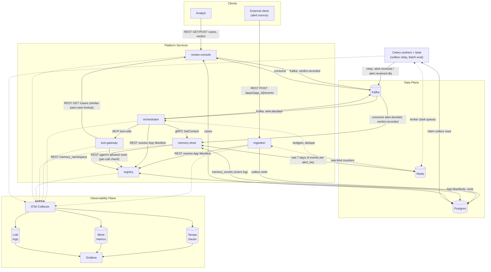

# Platform Block Diagram

A component-level view of the platform. For the day-by-day build sequence
see `docs/plan.md`; for the full design rationale, contracts, and the
multi-app model see `docs/ARCHITECTURE.md` (this doc is the picture,
`ARCHITECTURE.md` is the detail behind each block).

**Reading the diagram**: solid arrows are synchronous calls or event
publishes on the alert path (including the Celery outbox relay, which
carries every alert from Day 15); dashed arrows are telemetry
(traces/logs/metrics) or supporting links (Celery's broker).

**Deployment**: each block is one container (Compose) or one Deployment
(the local kind cluster from `docs/plan.md` Day 18), shared by every app.
Adding an app adds no blocks (`ARCHITECTURE.md` §12, ADR-0014).

**Scope**: everything drawn here is the platform. Alert sources and the
systems they monitor are outside it — they only appear as the external
client posting events. The platform triages; it doesn't detect or
remediate (`ARCHITECTURE.md` §2).

---

## Clients

### External client (alert source)
Whatever raises alerts for an app — a monitoring system (it-ops), a cloud
cost-anomaly detector (cost), a SIEM/EDR (security) — or, in this build,
`backend/scripts/simulate_alerts.py` standing in for all three, plus
curl during development. These systems are **outside** the platform: it
neither hosts nor observes them. Each source picks its app by URL
(`POST /apps/{app_id}/events`) — routing is never inferred. Talks only to
`ingestion`, over REST. Never talks to Kafka, `orchestrator`, or any other
internal service directly.

### Analyst
A human reviewing escalated cases through `review-console`'s REST API.
Only sees `ESCALATE` decisions — auto-resolved/suppressed alerts never
reach a person (see `review-console` below).

---

## Platform services

### `ingestion`
The only REST entrypoint for new events. Validates a request against the
target app's `event_schema_ref` (from `registry`'s App Manifest, 30s TTL
cache), enqueues it for `alert.received`, and returns `202` immediately — it
does not wait for a decision. Owns reliability at the edge: from Day 15 of
`docs/plan.md` it writes each event to the Postgres `outbox` table and the
Celery relay publishes it (DLQ after repeated message failures), so a Kafka
outage doesn't silently drop alerts. Also enforces rate limits per `app_id`
and per source (Day 14, `429` + `Retry-After`).

### `orchestrator`
The agent runtime — the only service that runs LLM tool-calling loops. On
consuming `alert.received`, it resolves the event's `app_id` against
`registry` to get that app's agent config and tool allowlist, calls
`memory-store` once for behavioral context (before the loop, over one
shared gRPC channel, ADR-0019), runs the agent's tool-calling loop
(LangChain's prebuilt agent inside a LangGraph run graph, ADR-0022) against
`tool-gateway` with that context in the prompt, applies the supervisor
(the agent's confidence capped by fixed rules, against the manifest's
threshold, ADR-0020) and the manifest's deterministic `escalate_when`
guardrails (both can only raise a decision to `ESCALATE`,
`ARCHITECTURE.md` §5/§13), and publishes `alert.decided` with
`confidence` and `reasons[]` populated from its own tool-call trace and
those checks.
One service runs every app's agents: an agent is a manifest entry (prompt,
tool allowlist, role), and each alert gets an ephemeral run of it — nothing
is spawned per app or per alert.
Also exposes `RunAgent` as a direct gRPC call (same contract, synchronous
path) for testing without going through Kafka (with a callable's
`agent_id`, it runs just that callable). Agent delegation is in-process
(ADR-0012): once the entry decision is final, the run graph fans out to
every callable agent whose `invoke_on` matches, in parallel (e.g.
`it-ops-triage`'s `root-cause-summarizer` on `ESCALATE`), folding their
`reasons[]` into the entry agent's before publishing `alert.decided`
(`docs/ARCHITECTURE.md` §3/§5). One level, one direction, scoped to one
app's own manifest — not cross-app A2A. Owns cost/budget enforcement per
`app_id`/agent (Day 14), dedupe of at-least-once deliveries (Day 16), and
circuit-breaking around tool calls (Day 12).

### `tool-gateway`
An MCP server — the only service that executes tools. Every tool is a
read-only lookup (no remediation). Tools are either `global` (platform code
in `tool-gateway` itself, available to any app that allowlists them — e.g.
`similar-past-case-lookup`, which reads `review-console`'s `GET /cases`
filtered by the caller's `app_id`) or `app`-scoped (owned by one app,
loaded at startup from `backend/apps/{app_id}/tools/`; fixture-backed in
this build). Validates every tool
call's input against the schema registered in `registry` before executing,
enforces a per-call timeout, and wraps execution in retry/backoff + a
circuit breaker so a broken tool degrades predictably instead of hanging
the whole platform.

### `memory-store`
The only service that reads/writes behavioral history. Serves `GetContext`
over gRPC — rolling-window counts (1h/24h/7d) of decisions (and, from
Day 10, analyst verdicts) per `alert_key`, plus `is_novel_alert` and
`has_confirmed_incident_history`. History is an event log (ADR-0017): it
consumes `alert.decided` (ADR-0016) and, from Day 10, `verdict.recorded`,
storing one Postgres `memory_events` row per event — the source of truth.
Redis caches each key's last 7 days, prefixed by the app's
`memory_namespace` (looked up from `registry`, ADR-0018) so two apps'
identical alert keys never collide; a cache miss rebuilds from Postgres.
Verdicts feeding back into these counts is the platform's feedback loop
closing.

### `registry`
The capability and app directory. Two things live here: (1) agent/tool
registrations with versions and schemas, and (2) **App Manifests** — one
per configured use case, declaring that app's agents (incl. `invoke_on` for
callables), tools, event schema, and memory namespace. A manifest's source
of truth is `backend/apps/{app_id}/manifest.yaml`; `register_app.py`
upserts it here, and `registry` validates it on the way in. It serves each
app *resolved*: every agent carries the tools it may call right now
(allowlisted, declared, enabled). `ingestion`, `orchestrator` and
`tool-gateway` resolve "what am I allowed to do for this `app_id`" by
asking `registry` (cached 30s), never by hardcoding it; `memory-store` reads
only the app's `memory_namespace`. This is what makes adding app #2
or #3 a registration plus an app folder, not a platform code change.

### `review-console`
The human-in-the-loop surface. Consumes `alert.decided` and persists only
`ESCALATE` decisions into `cases` (auto-resolve/suppress are high-volume
and need no human, so they're never stored here; duplicates are ignored).
Exposes `GET /cases` (filterable by `app_id`, `alert_key`, …), `GET
/cases/{id}` (reasoning and tool-call summary), and `POST
/cases/{id}/verdict` — verdict, `verdict_by`, and optional
`resolution_notes` (what actually fixed it) — which publishes
`verdict.recorded` back onto Kafka. `resolution_notes` stays on the case;
it reaches future agents via `similar-past-case-lookup`.

### Celery workers
Scheduled background work, with Redis as the broker and `celery-beat` as
the scheduler. Two jobs: the **outbox relay** (Days 15–16) — every ~1s,
publishes pending `outbox` rows to `alert.received`, or to
`alert.received.dlq` after repeated message-specific failures — and **batch
re-evaluation** against the eval fixture set (Day 25), nightly and on
demand. The relay is the one place Celery sits on the alert path: it adds
up to one relay interval of latency per alert, in exchange for no alert
being lost during a Kafka outage (`ARCHITECTURE.md` §10).

---

## Data plane

### Kafka
The event backbone connecting `ingestion` (via the Celery outbox relay),
`orchestrator`, `review-console`, and `memory-store` (which reads
`alert.decided` in its own consumer group). Four topics:
`alert.received`, `alert.decided` (both protobuf-encoded
`RunAgentRequest`/`Response` — the same contract used for the `orchestrator`
gRPC entrypoint, so there's only one schema to maintain),
`verdict.recorded`, and `alert.received.dlq` (alerts the relay gave up on,
for human inspection). Every message is keyed `{app_id}:{alert_key}`, so
one alert key's events stay ordered on one partition while different keys
spread across replicas (`ARCHITECTURE.md` §8). Trace context rides in
Kafka headers so a single event's journey is one connected trace, not five
disjoint ones.

### Redis
`memory-store`'s hot-path cache of each alert key's recent events
(`mem:{memory_namespace}:{alert_key}:events`, a 7-day sorted set, plus
`:facts`), `orchestrator`'s
per-app/agent budget counters (`budget:{app_id}:{agent_id}:{date}`) and
dedupe markers (`seen:{app_id}:{alert_id}`), `ingestion`'s rate-limit
counters, and Celery's broker (task queue, in a separate Redis DB index).

### Postgres
Single local instance, five concerns: `cases` (review-console, app-scoped),
`memory_events` (memory-store's event log, app-scoped), `apps` and `tools`
(registry's App Manifests and tool registrations), and `outbox` (ingestion's pending Kafka
publishes, drained by the Celery relay).

---

## Observability plane

### OTel Collector
Receives OTLP traces/logs/metrics from every service and fans out to the
three backends below. Before Day 23 of `docs/plan.md`, services log JSON to
stdout and create spans against a no-op-exported `TracerProvider`. The
Collector and its three backends run in Compose from Day 1 (it accepts OTLP
on `4317`/`4318`), but no service exports to it until Day 23.

### Tempo / Mimir / Loki
Traces, metrics, and logs respectively — each queried through Grafana, not
directly.

### Grafana
Dashboards: RED metrics per service, Kafka consumer lag, outbox backlog and
DLQ count, decision distribution (auto-resolve/escalate/suppress) and
latency per app, and — from Day 24 — LLM cost/token burn rate and tool-call
volume per app and agent. For the platform's operators only; it never
shows alert sources' or monitored systems' own telemetry.
