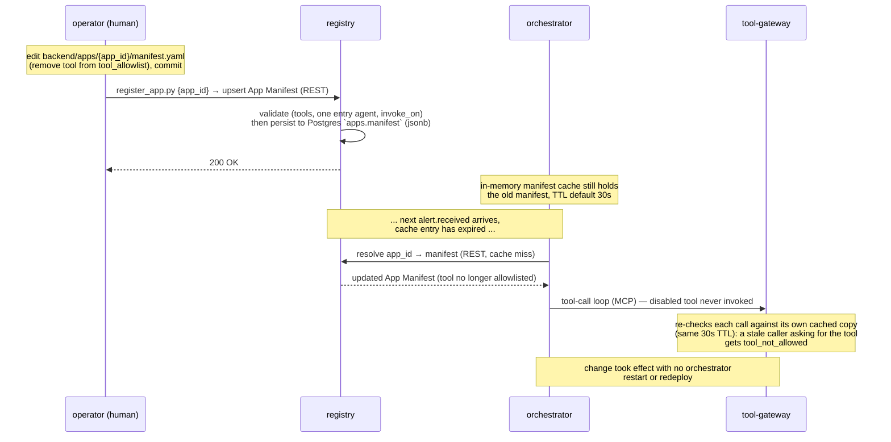
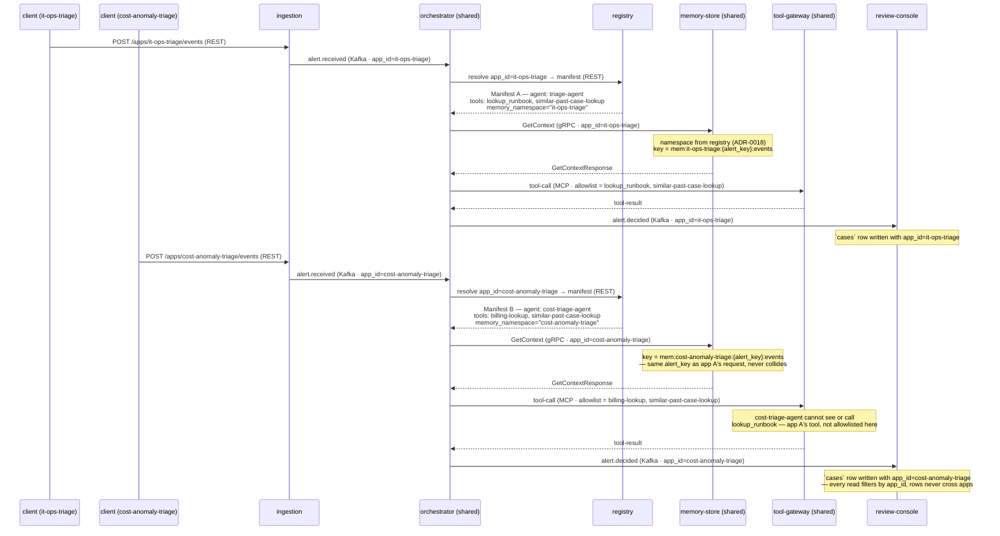
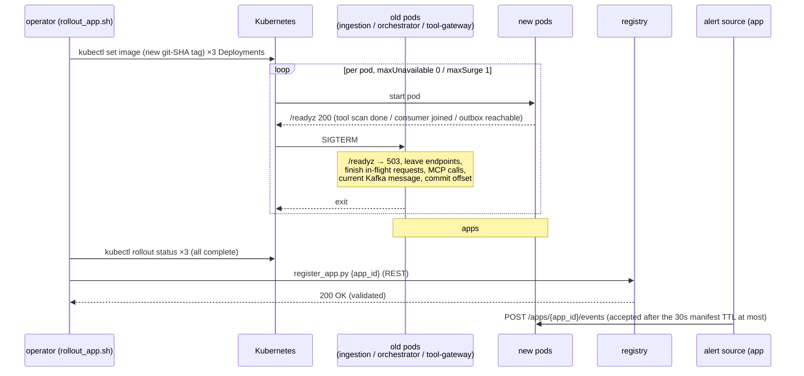

# Sequence diagrams

Five representative flows through the platform, drawn from
`docs/ARCHITECTURE.md` §3–§9. The first three aren't formally named "use
cases" in that doc — they're the sequences that are actually distinct
end-to-end (the fourth possible decision path, `SUPPRESS`, is
sequence-identical to `AUTO_RESOLVE` and is folded into diagram 1). Each
diagram is followed by a services/messages/transport table for quick
reference. Section numbers point back to the source of truth.

Diagram 4 uses a second app, `cost-anomaly-triage`, to make multi-app
isolation visible. It's documented as a second worked example in
`docs/ARCHITECTURE.md` §3, alongside `it-ops-triage`. It's app #2 in
`docs/plan.md` (first cut Day 13, finished Day 17), but **no code for it
exists in the repo yet** — treat this diagram as the intended design, not
documentation of something already built. App #3, `security-alert-triage`,
follows the exact same sequence as diagram 1/2 with its own manifest and
isn't drawn separately; diagram 5 shows how it's *shipped* (the first app
rolled out on Kubernetes, `docs/plan.md` Day 20, ADR-0014).

All diagrams draw `ingestion → orchestrator` as a single Kafka hop. From
Day 15 that hop physically goes through the Postgres `outbox` and a Celery
relay (`ARCHITECTURE.md` §10) — same message, same consumer, up to ~1s
added latency.

---

## 1. Auto-resolve / suppress — no human involved

The common-case path: `orchestrator` decides without escalating, so
`review-console` receives the event but never persists a case (§4 steps 1–3).

```mermaid
sequenceDiagram
    participant Client as external client
    participant Ingestion as ingestion
    participant Orchestrator as orchestrator
    participant Registry as registry
    participant MemoryStore as memory-store
    participant ToolGateway as tool-gateway
    participant ReviewConsole as review-console

    Client->>Ingestion: POST /apps/{app_id}/events (REST)
    Ingestion->>Ingestion: validate against event_schema_ref
    Ingestion->>Orchestrator: alert.received (Kafka · RunAgentRequest)
    Ingestion-->>Client: 202 Accepted (once Kafka has it; from Day 15, once the outbox row commits)

    Orchestrator->>Registry: resolve app_id → manifest (REST, 30s TTL cache)
    Registry-->>Orchestrator: App Manifest

    Orchestrator->>MemoryStore: GetContext (gRPC)
    MemoryStore-->>Orchestrator: GetContextResponse (windowed aggregates)

    Orchestrator->>ToolGateway: tool-call (MCP, allowlisted tools only)
    ToolGateway-->>Orchestrator: tool-result

    Note over Orchestrator: LLM (with context) → supervisor (confidence ≥ threshold)<br/>→ escalate_when guardrails (none matched) → decision = AUTO_RESOLVE or SUPPRESS

    Orchestrator->>ReviewConsole: alert.decided (Kafka · RunAgentResponse)
    Note over ReviewConsole: decision ≠ ESCALATE →<br/>not persisted to `cases`, no analyst action
    Orchestrator->>MemoryStore: alert.decided (Kafka · own consumer group)
    Note over MemoryStore: one decision event in memory_events + Redis<br/>— the next GetContext for this alert_key counts it
```

| Step | Services | Message | Transport |
|---|---|---|---|
| 1 | client → `ingestion` | event payload | REST |
| 2 | `ingestion` → `orchestrator` | `alert.received` (`RunAgentRequest`) | Kafka |
| 3 | `orchestrator` → `registry` | manifest read | REST |
| 4 | `orchestrator` → `memory-store` | `GetContext` | gRPC |
| 5 | `orchestrator` → `tool-gateway` | tool-call / tool-result | MCP |
| 6 | `orchestrator` → `review-console` | `alert.decided` (`RunAgentResponse`) | Kafka |
| 7 | `orchestrator` → `memory-store` | `alert.decided`, same message, separate consumer group (ADR-0016) | Kafka |

---

## 2. Escalate — delegation + human review + verdict feedback

The full loop: entry agent delegates to the callable agent, a case lands in
front of an analyst, and the verdict flows back to close the loop (§3 agent
delegation, §5 delegation call, §4 steps 4–5).

```mermaid
sequenceDiagram
    participant Client as external client
    participant Ingestion as ingestion
    participant Orchestrator as orchestrator (triage-agent)
    participant Registry as registry
    participant MemoryStore as memory-store
    participant ToolGateway as tool-gateway
    participant ReviewConsole as review-console
    participant Analyst as analyst (human)

    Client->>Ingestion: POST /apps/{app_id}/events (REST)
    Ingestion->>Ingestion: validate against event_schema_ref
    Ingestion->>Orchestrator: alert.received (Kafka · RunAgentRequest)
    Ingestion-->>Client: 202 Accepted (once Kafka has it; from Day 15, once the outbox row commits)

    Orchestrator->>Registry: resolve app_id → manifest (REST, 30s TTL cache)
    Registry-->>Orchestrator: App Manifest

    Orchestrator->>MemoryStore: GetContext (gRPC)
    MemoryStore-->>Orchestrator: GetContextResponse

    Orchestrator->>ToolGateway: tool-call (MCP, allowlisted tools only)
    ToolGateway-->>Orchestrator: tool-result

    Note over Orchestrator: LLM → supervisor → escalate_when guardrails<br/>(any can raise to ESCALATE) → final decision = ESCALATE

    Note over Orchestrator: callables with invoke_on ∋ ESCALATE →<br/>root-cause-summarizer (in-process graph branch,<br/>parallel if several · ADR-0012/0022)
    Orchestrator->>ToolGateway: tool-call, summarizer's allowlist:<br/>recent-changes-lookup (2h before fired_at), lookup_runbook (MCP)
    ToolGateway-->>Orchestrator: tool-result
    Note over Orchestrator: summarizer answers {"reasons": [...]}:<br/>probable cause citing a change ref or runbook
    Note over Orchestrator: orchestrator folds summarizer's reasons[]<br/>into triage-agent's, prefixed "root-cause-summarizer: ...",<br/>and appends its tool calls (agent_id-tagged · ADR-0023)

    Orchestrator->>ReviewConsole: alert.decided (Kafka · RunAgentResponse, decision=ESCALATE,<br/>incl. the alert itself · ADR-0023)
    Note over ReviewConsole: persists an OPEN `cases` row (Postgres, app_id-scoped)
    Orchestrator->>MemoryStore: alert.decided (Kafka · own consumer group)
    Note over MemoryStore: records decision:ESCALATE for that alert_key

    Analyst->>ReviewConsole: GET case list/detail (REST)
    ReviewConsole-->>Analyst: case incl. the alert, reasons[], tool_calls[] (explainability trace)
    Analyst->>ReviewConsole: submit verdict + optional resolution_notes (REST)
    Note over ReviewConsole: OPEN → RESOLVED exactly once (a second verdict is a 409);<br/>verdict.recorded published before the row commits
    Note over ReviewConsole: resolution_notes stored on the case only —<br/>later surfaced via similar-past-case-lookup

    ReviewConsole->>MemoryStore: verdict.recorded (Kafka · {app_id, case_id, alert_key, verdict, verdict_by, recorded_at})
    MemoryStore->>MemoryStore: record a verdict event in memory_events + Redis<br/>for that alert_key (closes feedback loop)
```

| Step | Services | Message | Transport |
|---|---|---|---|
| 1 | client → `ingestion` | event payload | REST |
| 2 | `ingestion` → `orchestrator` | `alert.received` (`RunAgentRequest`) | Kafka |
| 3 | `orchestrator` → `registry` | manifest read | REST |
| 4 | `orchestrator` → `memory-store` | `GetContext` | gRPC |
| 5 | `orchestrator` → `tool-gateway` | tool-call / tool-result (triage-agent) | MCP |
| 6 | `orchestrator` (in-process) | callable `root-cause-summarizer` runs as a branch of the run graph | — |
| 7 | `orchestrator` → `tool-gateway` | tool-call / tool-result (summarizer, its own `agent_id` in `_meta`) | MCP |
| 8 | `orchestrator` → `review-console` | `alert.decided` (`RunAgentResponse`, ESCALATE) | Kafka |
| 9 | `orchestrator` → `memory-store` | `alert.decided`, separate consumer group (ADR-0016) | Kafka |
| 10 | analyst → `review-console` | case read / verdict submit | REST |
| 11 | `review-console` → `memory-store` | `verdict.recorded` | Kafka |

---

## 3. Manifest edit — no redeploy, takes effect within one TTL window

Demonstrates the "config, not code" promise: an operator removes a tool
from an agent's allowlist in the app's checked-in `manifest.yaml` and runs
`register_app.py`, and the next alert for that app picks up the change
without an `orchestrator` restart (§3: "this is what `plan.md` Day 5's 'no code change
or redeploy' definition of done depends on").



| Step | Services | Message | Transport |
|---|---|---|---|
| 1 | operator (`register_app.py`) → `registry` | manifest upsert | REST |
| 2 | `registry` → Postgres | persist `apps.manifest` (jsonb) | internal (Postgres write) |
| 3 | `orchestrator` → `registry` | manifest read, post-TTL-expiry | REST |
| 4 | `orchestrator` → `tool-gateway` | tool-call (now minus the disabled tool) | MCP |

---

## 4. Two apps, one shared core — isolation in practice

*Planned — `cost-anomaly-triage` is app #2 in `docs/plan.md` (Day 13/17)
but not built yet; only `it-ops-triage` exists in the repo so far.* Same `orchestrator`,
`tool-gateway`, `memory-store` process handling both apps' alerts back to
back, showing where the §3 isolation guarantee (`app_id`, `memory_namespace`,
`tool_allowlist`) actually bites.



| Step | Services | Message | Transport | Isolation mechanism |
|---|---|---|---|---|
| 1–2 | client A → `ingestion` → `orchestrator` | event / `alert.received` (`app_id=it-ops-triage`) | REST / Kafka | `app_id` carried on every payload |
| 3 | `orchestrator` → `registry` | manifest read | REST | manifest lookup keyed by `app_id` |
| 4 | `orchestrator` → `memory-store` | `GetContext` | gRPC | `memory_namespace` prefixes the Redis key |
| 5 | `orchestrator` → `tool-gateway` | tool-call | MCP | `tool_allowlist` scopes which tools this app's agent can reach |
| 6 | `orchestrator` → `review-console` | `alert.decided` | Kafka | `cases` row carries `app_id`, filtered on every read |
| 7–12 | same steps, client B, `app_id=cost-anomaly-triage` | — | — | identical mechanisms, disjoint values — same `alert_key` on both sides never collides |

`similar-past-case-lookup` (`scope: global`) is allowlisted by both apps
— one implementation, but it filters by the calling agent's `app_id`, so
each app only ever sees its own past cases. `billing-lookup` and
`lookup_runbook` are `scope: app` and can never appear outside the
manifest that declares them.

---

## 5. Adding an app on Kubernetes — rolling update, then registration

*Planned — `docs/plan.md` Days 18–20, ADR-0014.* App #3 and every app
after it ship this way. Code goes first, one pod at a time, while other
apps keep being served. The manifest is registered only when every pod of
all three services runs the new image, so the new app can't receive an
event that an old pod can't handle (§12 rollout order, ADR-0006).



| Step | Who | What | Transport |
|---|---|---|---|
| 1 | operator → Kubernetes | new image tag on `ingestion`, `orchestrator`, `tool-gateway` | `kubectl` |
| 2 | Kubernetes ↔ pods | start new pod, wait for `/readyz`, drain and stop an old pod; repeat | HTTP probes, SIGTERM |
| 3 | operator → Kubernetes | wait for all three rollouts to complete | `kubectl rollout status` |
| 4 | operator → `registry` | register the new app's manifest | REST |
| 5 | alert source → `ingestion` | first events for the new app | REST |

Before step 4, `ingestion` rejects the new `app_id` (no registered
manifest), so nothing for the new app is in flight while old and new pods
coexist. A pod that fails `/readyz` stalls the rollout with old pods still
serving; `kubectl rollout undo` reverts it.
