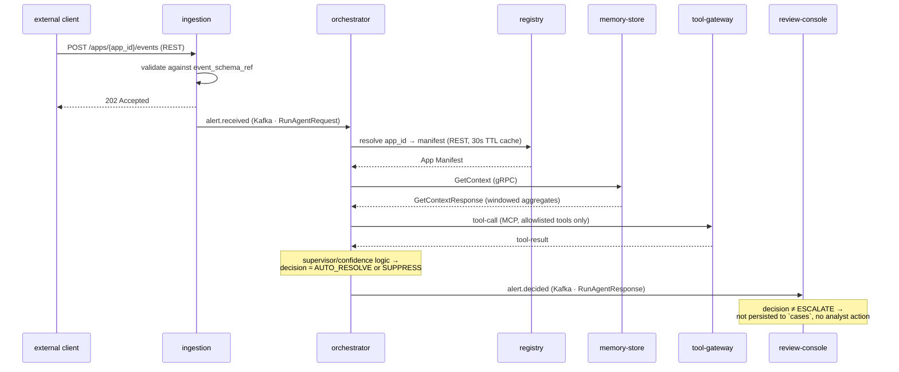
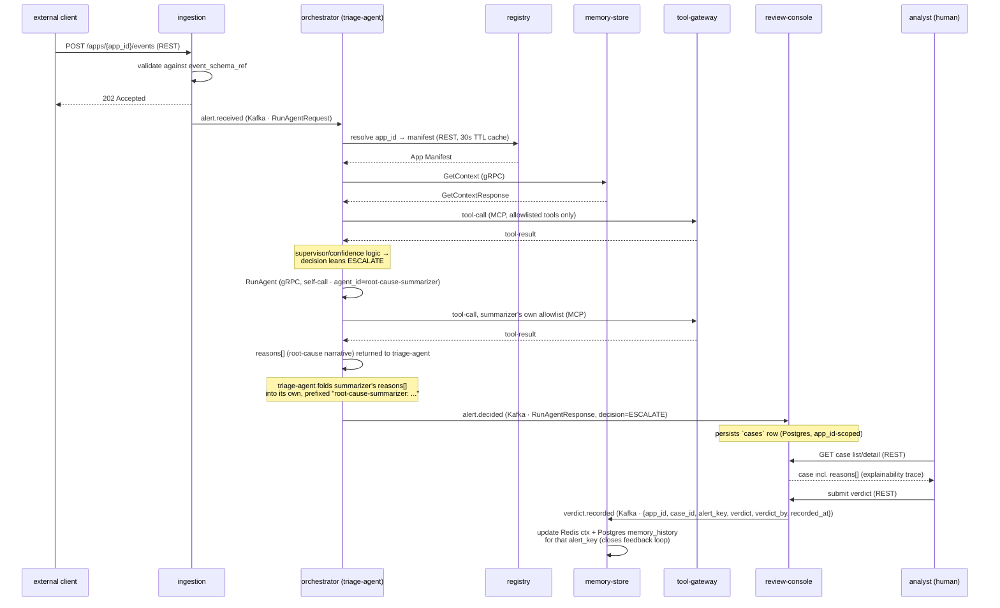
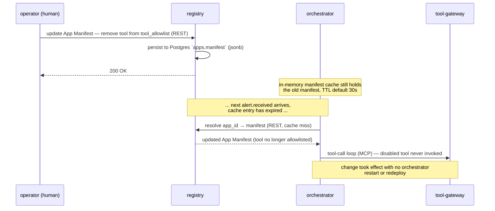
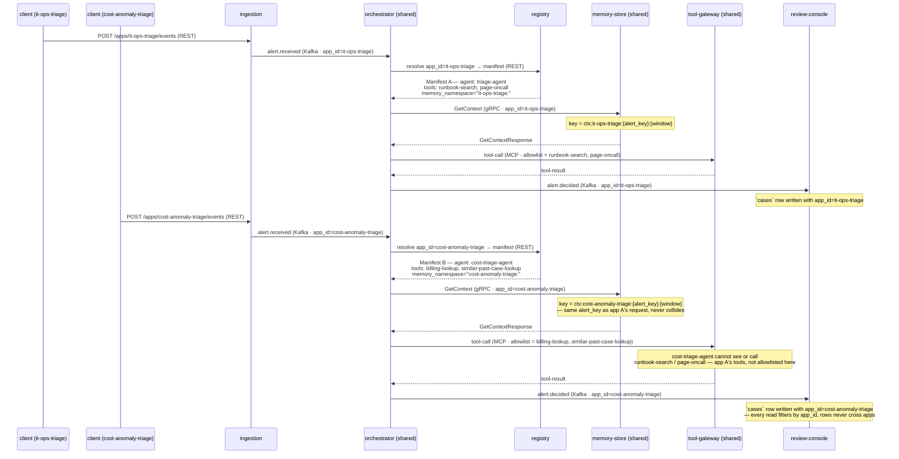

# Sequence diagrams

Four representative runtime flows through the platform, drawn from
`docs/ARCHITECTURE.md` §3–§9. The first three aren't formally named "use
cases" in that doc — they're the sequences that are actually distinct
end-to-end (the fourth possible decision path, `SUPPRESS`, is
sequence-identical to `AUTO_RESOLVE` and is folded into diagram 1). Each
diagram is followed by a services/messages/transport table for quick
reference. Section numbers point back to the source of truth.

Diagram 4 uses a second app, `cost-anomaly-triage`, to make multi-app
isolation visible. It's documented as a second worked example in
`docs/ARCHITECTURE.md` §3, alongside `it-ops-triage` — but **no code for it
exists in the repo**, and it isn't scheduled in `docs/plan.md` (which only
tracks unnamed "apps #2-3" at Day 12/15). Treat both the §3 description and
this diagram as illustrative of the multi-app model, not documentation of
something already built.

---

## 1. Auto-resolve / suppress — no human involved

The common-case path: `orchestrator` decides without escalating, so
`review-console` receives the event but never persists a case (§4 steps 1–3).

| Step | Services | Message | Transport |
|---|---|---|---|
| 1 | client → `ingestion` | event payload | REST |
| 2 | `ingestion` → `orchestrator` | `alert.received` (`RunAgentRequest`) | Kafka |
| 3 | `orchestrator` → `registry` | manifest read | REST |
| 4 | `orchestrator` → `memory-store` | `GetContext` | gRPC |
| 5 | `orchestrator` → `tool-gateway` | tool-call / tool-result | MCP |
| 6 | `orchestrator` → `review-console` | `alert.decided` (`RunAgentResponse`) | Kafka |

---

## 2. Escalate — delegation + human review + verdict feedback

The full loop: entry agent delegates to the callable agent, a case lands in
front of an analyst, and the verdict flows back to close the loop (§3 agent
delegation, §5 delegation call, §4 steps 4–5).

| Step | Services | Message | Transport |
|---|---|---|---|
| 1 | client → `ingestion` | event payload | REST |
| 2 | `ingestion` → `orchestrator` | `alert.received` (`RunAgentRequest`) | Kafka |
| 3 | `orchestrator` → `registry` | manifest read | REST |
| 4 | `orchestrator` → `memory-store` | `GetContext` | gRPC |
| 5 | `orchestrator` → `tool-gateway` | tool-call / tool-result (triage-agent) | MCP |
| 6 | `orchestrator` → `orchestrator` | `RunAgent` self-call, `agent_id=root-cause-summarizer` | gRPC |
| 7 | `orchestrator` → `tool-gateway` | tool-call / tool-result (summarizer) | MCP |
| 8 | `orchestrator` → `review-console` | `alert.decided` (`RunAgentResponse`, ESCALATE) | Kafka |
| 9 | analyst → `review-console` | case read / verdict submit | REST |
| 10 | `review-console` → `memory-store` | `verdict.recorded` | Kafka |

---

## 3. Manifest edit — no redeploy, takes effect within one TTL window

Demonstrates the "config, not code" promise: an operator disables a tool via
`registry`, and the next alert for that app picks up the change without an
`orchestrator` restart (§3: "this is what `plan.md` Day 5's 'no code change
or redeploy' definition of done depends on").

| Step | Services | Message | Transport |
|---|---|---|---|
| 1 | operator → `registry` | manifest update | REST |
| 2 | `registry` → Postgres | persist `apps.manifest` (jsonb) | internal (Postgres write) |
| 3 | `orchestrator` → `registry` | manifest read, post-TTL-expiry | REST |
| 4 | `orchestrator` → `tool-gateway` | tool-call (now minus the disabled tool) | MCP |

---

## 4. Two apps, one shared core — isolation in practice

*Illustrative — `cost-anomaly-triage` is invented for this diagram; only
`it-ops-triage` actually exists in the repo.* Same `orchestrator`,
`tool-gateway`, `memory-store` process handling both apps' alerts back to
back, showing where the §3 isolation guarantee (`app_id`, `memory_namespace`,
`tool_allowlist`) actually bites.

| Step | Services | Message | Transport | Isolation mechanism |
|---|---|---|---|---|
| 1–2 | client A → `ingestion` → `orchestrator` | event / `alert.received` (`app_id=it-ops-triage`) | REST / Kafka | `app_id` carried on every payload |
| 3 | `orchestrator` → `registry` | manifest read | REST | manifest lookup keyed by `app_id` |
| 4 | `orchestrator` → `memory-store` | `GetContext` | gRPC | `memory_namespace` prefixes the Redis key |
| 5 | `orchestrator` → `tool-gateway` | tool-call | MCP | `tool_allowlist` scopes which tools this app's agent can reach |
| 6 | `orchestrator` → `review-console` | `alert.decided` | Kafka | `cases` row carries `app_id`, filtered on every read |
| 7–12 | same steps, client B, `app_id=cost-anomaly-triage` | — | — | identical mechanisms, disjoint values — same `alert_key` on both sides never collides |

`similar-past-case-lookup` (from the §3 worked example, `scope: global`)
would be available to both apps' allowlists if each manifest chose to
include it — `billing-lookup` and `runbook-search`/`page-oncall` are
`scope: app` and can never appear outside the manifest that declares them.
